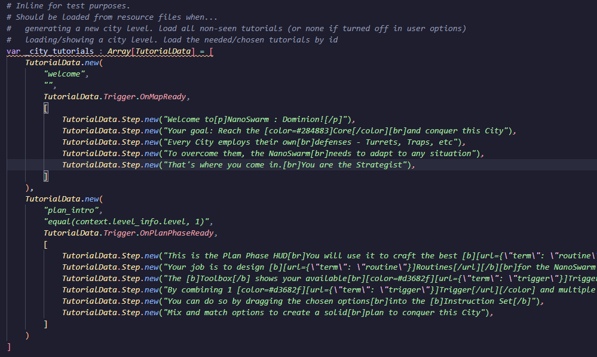
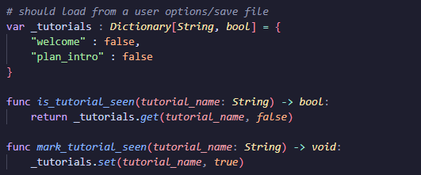
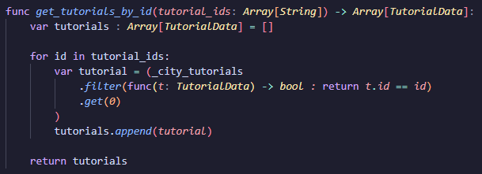
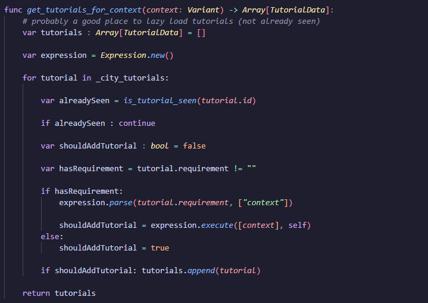
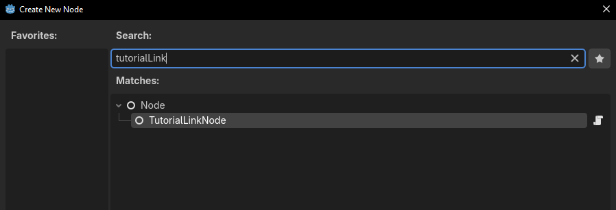
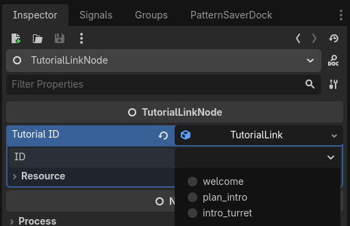
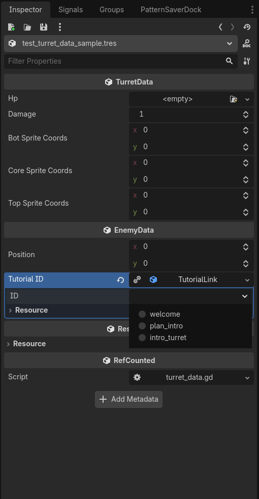
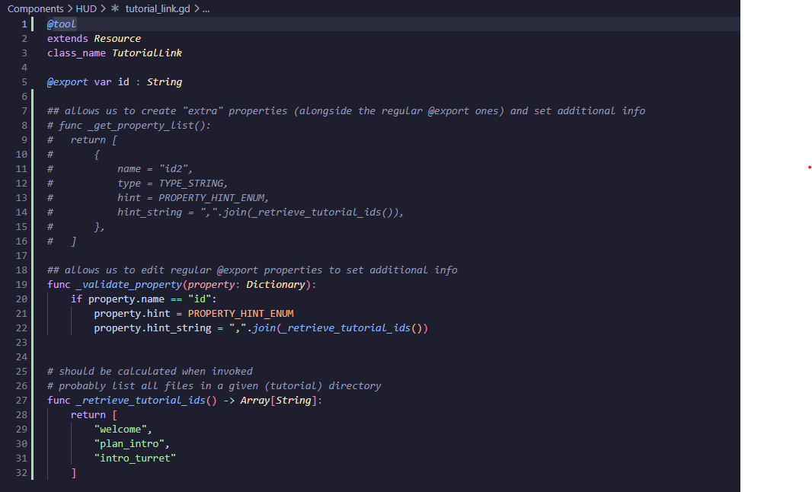

# Designing a Simple Tutorial System in Godot

```
scaffold : 
- intro, introduce what I am building
- one paragraph about the 'problem to solve'
- talk about the "goal" of the system and why I am building it
  - mostly 'cause I wanted to create one component / see what I could do
- quick bullet list with overview
- section about data modeling
- section about the UI component
- section about the trigger/queue/requirement system
  - mention the two explored ideas
- wiring everything up
- demonstration plus closing thoughts
```


## Modeling a Custom Resource for Tutorial Data

"TutorialData" custom resource
core fields : id, steps array (step also extends resource; each with "text" element)
- step (sub) resource, when declared inside the base TutorialData Resource, works just fine in code
- however, when trying to create the base TutorialData via Inspector panel, adding a new step doesn't work via editor
- with a standalone resource (separate file), works without issue
- it *can* be made to work, if need be, by adding a custom button to the exported properties (and tagging the resource with @tool) that, on click, adds the correct instance to the array
save/retrieve using ResourceSaver and ResourceLoader
can be "managed" in a singleton (autoload, in Godot) for easy access
mention utility dictionary to track which tutorial as been seen or not (id, bool)


## Creating the Tutorial Dialog UI Component

(check devlog#14)

mention the add child vs instantiate child issue (start at the @onready props problem)

mention the difference between packed scene "instantiate" method vs. instance placeholder "create_instance" method
- "instantiate" **does not** call the _ready method (only when adding the instance to the scene tree via add_child)
- "create_instance" **does** call the _ready method and already adds the instance to the scene tree (no add_child needed)


## Two Variations for the Tutorial Decision-Making System

base idea :
- create the multiple instances of "TutorialData"
- when entering a level, find out which ones to show
  - this point I had 2 ideas
- add the "to show" tutorials on a shared (utility) array
- at specific moments / intervals in the level, check if I have a tutorial to show
  - mention generic use cases
  - mention my use case : after transitioning to a new state in the city

version 1 : concentrate the logic on the TutorialData Resource
- added new fields : requirement(string), trigger (enum)
- goal : cycle through unseen tutorials when "needed" (my case : for a new level) > store relevant ones for later
- on level gen : find relevant tutorials for the level context > store those > save the ids in the level savefile
- on level load : get tutorials by id in savefile > filter by unseen ones > store those for later
- on state transition, check if there are stored tutorials with matching trigger. show those
- pro : more powerful; con : more "front heavy" (needs to cycle through all possible tutorials and evaluate expressions), requires to save in file for in-between loads






version 2 : have each entity hold which tutorials its linked to
- new custom resource : TutorialLink, with property id(string)
  - expected to contain an id of an existing tutorial
  - bonus : new wrapper Node TutorialLinkNode, with one TutorialLink export prop, to allow to "attach" a tutorial to any scenetree in the editor
  - explain the @tool usage
    - explain godot's validate property
  - explain the tutorial discovery on id set
- explain idea : when a regular entity (with one or more links) is instanced in the scene, each instanced link tries to also find (and add to the shared array)
- on state transition, try to pop a tutorial from the shared array and show if any. 
  - to support daisy chain, also do the check on tutorial end 
- pro : easy to use, once set up; con : hard to set up, less powerful with the conditions to show the tutorial




