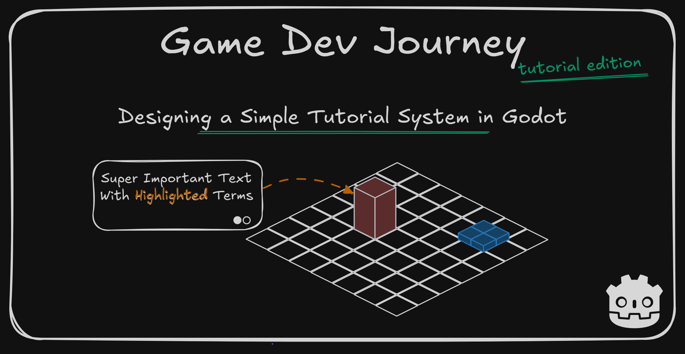
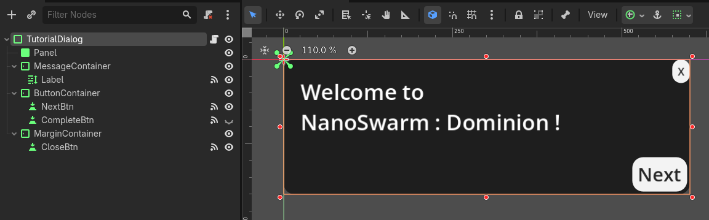
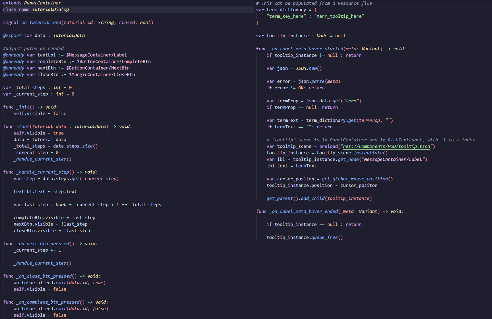
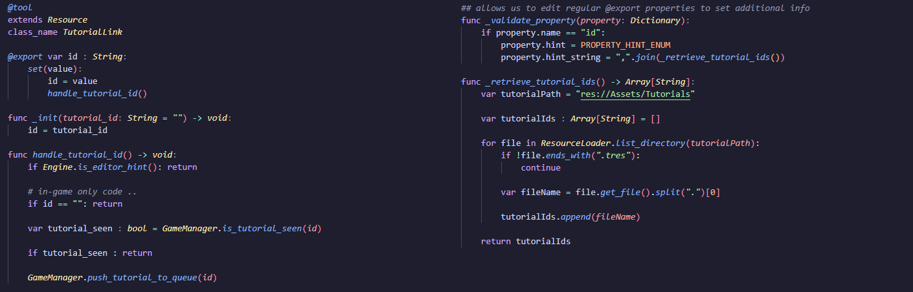

# Designing a Simple Tutorial System in Godot

Greetings, fellow traveler. Do you want to create your own tutorial system for your game ? A simple, dialog-style, configurable, tutorial system ? 

In this blog post, I write about developing the tutorial system from scratch in Godot (and GDScript) for my own game - NanoSwarm : Dominion. Not just the "final result", but the thought process behind each step, what worked and what didn't, and general useful tricks applicable in other scenarios.



There are multiple ways of designing an in-game Tutorial, from dedicated tutorial levels to NPC characters that explain a given mechanic out to the player. For my game, I decided to present tutorials using a "dialog-style" UI that may show up when starting a new level or encountering a new enemy.

Creating one tutorial in this manner is a simple-enough matter. All it would take is to create the needed UI elements, write out the text I want to show and make it pop up when entering the `Scene`. *However*, once I want to create multiple different tutorial dialogs and I want to show them at different times, across different `Scenes` in Godot it quickly transforms into a jumbled mess.

So, to prevent that, let's design something that's both simple to use and flexible to support my needs (and hopefully yours). 

> And how are we going to do that ?

Simple. After creating two or three different tutorials "manually" and comparing them with each other, we notice a pattern. Every tutorial can have the same **visuals**, with only the **content** being truly unique and with some common **rules** as to when they should trigger. 

With this in mind, I decided to split the system in three components :
- the **TutorialData** : A `Resource` that holds the data for a given Tutorial
- the **TutorialDialog** : A `Control` scene responsible to display **TutorialData** to the player
- the **Decision-Making System** : A `Script` containing logic that will dictate when a Tutorial should be shown

With this system implemented, I am able to focus on writing down different tutorials in their own `Resource` files and having them show up when I want to, without having to shuffle through all my game's files to see where I should do something or not.

Here's a sneak peek of the final result :
[](https://youtu.be/4wo-pN52NXY)

On the following sections, I'll do my best to explain "how" I implemented each component as well as the "why" behind some core decisions. All of the components can (and should!) be customized to fit a game's specific needs. 

## Modeling a Custom Resource for Tutorial Data

For the first element in our plan, I got the "TutorialData" - a custom `Resource` we can use to save (in a easy-to-retrieve file) the info for a given piece of knowledge we want to present to the player. You can add any property you feel it's important to it, as long as it's serializable. 

> Serializable ? So, use primitive types like String or int ?

Yes, as well as other custom classes you create that are *also* `Resources` (so, any class that inherits from the base "Resource" class).

For my first version, I focused on having an "id" property (to quickly find a given tutorial later on) and an array of "Steps", with each one being a second `Resource` with a text property for the contents I want to display on the screen. Later on, I could extend this to add other properties like an "anchor" to tell where the text should be in the screen (in case I want each step to appear in different corners of the screen). Here's the code snippet for you to use as a base:

```
# file 'tutorial_data.gd'
extends Resource
class_name TutorialData

@export var id: String
@export var steps : Array[TutorialDataStep]

func _init(_id: String, _steps: Array[TutorialDataStep] = []) -> void: 
	id = _id
	steps = _steps

# file 'tutorial_data_step.gd'
extends Resource
class_name TutorialDataStep

@export_multiline var text : String

func _init(label_text: String = "") -> void:
	text = label_text
```

Now, an important callout before moving on. In this snippet, I could have created the "TutorialDataStep" `Resource` in the same file as my "TutorialData", as a nested `Resource`. And in fact, I did at the start. However, when I was creating new tutorials in Godot's `Inspector` Panel, it was not recognizing the "TutorialDataStep" properly when I tried to add a new item to the "steps" array. Hence me extracting it to it's own file. May be a Godot quirk, or a bug that could be fixed down the line (or just my bad luck). 

With this `Resource`, we can now create a sample instance of it and move along. For example, in my game I have a singleton class named "GameManager" (in Godot it's a feature named "AutoLoad") that I use to share some common info. I created one or two sample instances inside an array and used that for my tests. Once I got comfortable, I moved them to dedicated resource files (.tres) and loaded them during the "GameManager" instantiation. In case you never worked with resource loading, here's another snippet:

```
var _tutorials : Array[TutorialData] = []

func _init() -> void:
	_load_tutorials()

func _load_tutorials() -> void:
	var tutorialPath = "res://Assets/Tutorials"

	for file in ResourceLoader.list_directory(tutorialPath):
		if !file.ends_with(".tres"): continue

		var resource = ResourceLoader.load(tutorialPath + "/" + file)

		if resource is not TutorialData:
			push_error("Found unknown resource in tutorial data folder")
			continue

		_tutorials.append(resource as TutorialData)		
```

Bonus points : If we want to keep track which tutorials were already seen or not, it's also really easy to do. One plan `Dictionary[String, bool]` to keep track of which tutorial id has been seen or not, store it in it's own file and we got it covered (from a data-perspective)

> And how or when do we mark it as "seen" ?

Once our soon-to-be-created Dialog component tells us to, for example. Just because it's an "UI" component, it doesn't necessarily mean it only "shows" information. Check the next section.

## Creating the Tutorial Dialog UI Component

With the data portion of this system taken care of, we now need a way of presenting it to the player. As I eluded to before, I chose to use "dialog-style" cards to show the tutorials to the player. It's a simple way to start off that can be improved on later down the line. One good thing of separating the components like we are doing here - we can work off on one without negatively impacting the others.

To start, we can create a new `Scene` for our "TutorialDialog" component. I used a `PanelContainer` as root node, coupled with `Buttons`, a `RichTextLabel` and a few `MarginContainers` (so the elements don't render too close to each other). You can add or remove elements to suit your needs. The only "mandatory" ones are the "Label" (a place to put the "step" text in) and the buttons for interaction.



> Why are we using RichTextLabel, instead of the base Label ?

The `RichTextLabel` includes support for [BBCode](https://docs.godotengine.org/en/stable/tutorials/ui/bbcode_in_richtextlabel.html), a syntax that allows us to style our text. We can use it to make certain words appear in *italic* or in **bold**, or with a different color altogether (example : highlight a specific *concept* in the game) and more! Just don't forget to enable it before using by selecting the node, looking at the `Inspector` panel and toggle `BBCode Enabled`.

Once the visual aspect is to our liking, it's time to add some functionality to it. And there are a couple of objectives we want to achieve with this small - but important - component:
- Be able to access one instance of our "TutorialData" `Resource`
- Be able to show the text of one "step" at a time
- Be able to move forward to the next step
- Be able to close the dialog at any time

> That sounds like a lot! Certainly more than a couple.

Perhaps. But each individual objective is easy to implement. In fact, I'll add one more to the list:
- Be able to hover highlighted words and see a tooltip with an explanation

All we need is the correct tools (and knowledge) for the job. Which I will explain... now!

- One "TutorialData" property, with it's value set *when* we want to show a specific tutorial
- One "on_pressed" event handler on each button, to handle the "next step" or "close dialog" requests.
- One custom signal that we emit on dialog close, for integration purposes (example : on close, mark as seen)
- Two "on_label_meta_hover" event handlers on our label for the contextual tooltip logic

> I... Will need some notes.

Try to imagine the final result in use : You instance the "TutorialDialog" component and give it some data to work with. It shows you the first step's text. If you click the "dismiss" button, it ends the tutorial and closes the dialog. If you click the "next" button, it shows you the next step's text, until reaching the last step. At this point, the "next" button gives place to the "complete" button, which also ends the tutorial. At any point, if you see an highlighted keyword, you can mouse over it, triggering a "start" event that signals your dialog to show a tooltip. Once you mouse out of it, it triggers a "end" event that signals your dialog to hide the tooltip.

> Okay, I can see the plan now. Please proceed.

Down below I have included the base script to implement all of these behaviors. If you - the reader! - need help in any particular section, just reach out!



Before I forget : For the tooltips to work, we have to "mark" the words in our "TutorialData" steps that we want to be "highlighted" in this manner with some metadata. Otherwise they are "just words". To do that, we just need to surround our words with an "url" `BBCode` tag plus the proper metadata. So, if we have something like "sword" written out, it could become something like "[url={"term" : "weapon"}]sword[/url]. This paired with our previous script gives us the on-hover tooltip effect!

Doing everything up until this point gives us a solid base. We have a way of creating tutorials and a way of showing said tutorials. I suggest taking a break and testing it out on an existing `Scene` in the game. Something simple. Instantiating one singular tutorial on the `_ready()` handler, for example. To start, we can add an instance of this "TutorialDialog" component as a child on our `Scene` and then wiring it up with script.

One key distinction I'd like to point out, especially for those starting out developing with Godot (like me). Looking at the Godot Engine, we have two buttons in the `Scene` panel that *look* similar : `Add Child Node` and `Instantiate Child Scene`. Most of the times, we will be using the former since it allows us to add the base Godot node types, while the second one allows us to add other `Scene` files we have already created, so they don't usually cross paths. 

However there *is* a use case where both options "work": When we are creating new `Scene` as components, with their unique class name and all the usual advantages it comes with (the most common one being inheritance, in case we want to implement different "flavors" of a given component). Which is the path I took. With this, I was able to use the `Add Child Node` button to add my newly created component to the `Scene` tree and it *seemed* correct.

But, once I tested it up, a few not-so-clear errors surged. All of my `@onready` properties that were accessors to child `Nodes`, such as the Label we added, were all returning `null`. This was due to the "TutorialDialog" **plus it's children** not being properly instantiated. Let this mistake serve as a lesson.

With that warning out of the way, there's one last piece of the puzzle remaining. Write out the "logic" that will handle "when" a given tutorial should be shown or not.

## Setting up the Decision-Making System (with two variations)

Now that we can create and present our tutorials in any `Scene` that we want, it would be neat to have "something" that can decide which tutorial to show and when, to stop us from having to write an individual piece of code for every tutorial we plan on having.

Of course, this can be achieved in multiple ways, and it will vary from game to game. But that doesn't mean we can't read some ideas and learn from them. It's one of the main reasons I am writing this article, after all. You could, for example, implement something that shows tutorials after loading a new level, or perhaps create specific items in the world that, when interacted with, trigger a specific tutorial.

For my game and due to it's roguelike nature, I decided I wanted something that would be able to show tutorials in possibly "any" level, depending on the elements that get picked by the game engine behind the scenes. This should allow it to present tutorials as they are needed instead of having "dedicated" tutorial levels at the beginning of the game.

The core of this idea is simple enough to implement and integrate with what I have already built. I am using state machines to manage the logic of a level, so I can adjust it to check for "tutorials to show" (in lack of a better expression) after transitioning to a given state, before moving forward.

As to which tutorials, however, I ended up having *two* ideas as to how I could do it. Variations of the main idea, to be more precise. So... I decided to implement both and see which one suited my needs best. I will briefly describe them on the following paragraphs so you can read and choose which suits *your* needs best. Or discard both altogether and come up with a better version for *your* game, that's more than fair.

### Expression-based rules for Tutorials

For the first idea, the goal is to have each level contain a list of "tutorials" (the ids suffice) that should be shown, when played. To do that, when the level was being generated, we could cycle through each (not seen) tutorial and evaluate a given "rule" to see if it should be included or not, based on what the level generator included in that particular level. Later on, when loading an already-generated level, all we have to do is check the previously-created tutorial list and we're good.

To aid in implementing this, we could use Godot's [Expressions](https://docs.godotengine.org/en/stable/tutorials/scripting/evaluating_expressions.html) which, as the name implies, allows us to dynamically evaluate in runtime an expression stored in a string. By extending our "TutorialData" `Resource` to have one more property, this can then be easily retrievable and used to see if we want to show a given tutorial or not.

> And what type of rules can we create with this ?

It can range from simple comparison expressions to more complex ones that use data or existing methods in a given class to perform theoretically any validation we want. But I should warn (and the documentation does too) : If the expressions can be manipulated by the player (or a malicious third party), it could be used to do tamper with your game. So, **if** you choose to use this approach, use it wisely.

Here is the main function for the whole idea : For a given context object, evaluate all tutorials' rules against it and return those that pass the test. The remaining bits are *very* project-specific, so I'll leave those to you!


To me, this idea is the more "powerful" one, since we can write almost "any" rule we want for a given tutorial to trigger or not, but it does require us to evaluate *every* rule at runtime when generating a new level, and to store it's result to persist between loads - especially important in my game, since I may want to show a tutorial when a player reaches a particular "state" in a level, and he saves and quits before that.

### Attachable Tutorial Link to Entities

For this second idea, the goal is to have each entity in our game "tell" us if it has a tutorial associated or not. From an entire level, to different types of enemies, to items in the world. A "link" to a tutorial. Then, when these entities get instanced, we can have these "links" to try and add their associated tutorial to a shared list of "queued tutorials" for us to show.

It probably sounds harder than it actually is. We can have our "queued tutorials" be an array somewhere we can already easily access in our game - in my case, it is the "GameManager" singleton. We can then check this list in the same moments as we would do, with the previous idea - in my case, after my level finishes a state transition. 

> And for actually adding the tutorials in said list ? The "link" magically places them there ?

In a sense, yes. If we replace "magically places them" with "on instantiation, it tries to access the shared list and append a value", it's pretty much the same thing.

By representing this "link "I mentioned as it's own `Resource` (named "TutorialLink"), that then can be used as a property of any other entity we choose to, we can then attach any logic we want to it. And I want a few things:
- An "id" property to hold the respective tutorial id
- When it's instanced at runtime, it accesses the "GameManager" and pushes it's "id" value to the shared tutorial list
- When I am managing my data (in the Godot's `Inspector` panel), I want to "pick" an existing id instead of typing it out

And to do all that, we could write something like this :



Notice the usage of [`@tool`](https://docs.godotengine.org/en/stable/tutorials/plugins/running_code_in_the_editor.html#how-to-use-tool) and the `Engine.is_editor_hint()` method. This allows us to only run the whole "add this value to this list" when the game is running, not when we are editing values in the Editor. I also extend the class property itself with [`_validate_property`](https://docs.godotengine.org/en/stable/classes/class_object.html#class-object-private-method-validate-property), allowing me to tell the Editor that the "id" property uses a finite list of values - retrieved from listing files in a folder, but this could be any logic you it to be.

To test out this custom `Resource`, I modified an existing class I had in my game to represent an enemy Turret. When editing the values in the `Inspector`, it looks like this (including the id dropdown picker and all): 


This approach takes a bit more knowledge to set up, but once we, using it in the project itself is easy and intuitive. I even created a `Node` wrapper around the "TutorialLink" (as in : a custom `Node` with one property - the link) so I could attach it as a child `Node` of anything I wanted in my `Scene` tree. It is also more restrictive in the conditions for a tutorial to "show up", when compared to the first approach. 

> Both look interesting! Which one should I choose ? 

Like I wrote above, I believe you - the reader - should choose the approach that best fits the project. Or, learn the qualities and tricks of both and create your own. As for which one *I* chose, I decided to use the attachable "TutorialLink" approach, while keeping the other approach in my notes just in case I end up needing to support some complex use cases.

## The Final Result

If all goes well, connecting all the pieces gives us one simple to use, yet flexible, system to present all sorts of tutorials to our players! Here's another look at the final result, showing tutorials being dismissed, followed along, and highlighted keywords with their own tooltips!

[](https://youtu.be/AdjwyIaIdo8)

Hope this blog post was helpful in any way.  
Got a question or just wanna discuss something? Feel free to reach out!  
And thank you for reading!