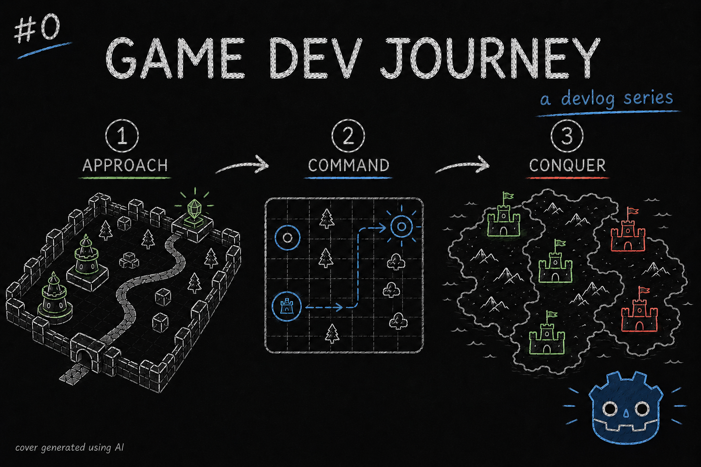

# Journey to create NanoSwarm: Dominion

Greetings, fellow traveler. Do you happen to play strategy games ? Enjoy theory-crafting the perfect build in a roguelite game ? Perhaps a developer looking for ideas for your own projects ?

Whatever the case, welcome! This is the first of - hopefully - many blog posts about my progress on creating **NanoSwarm: Dominion**.

In this devlog series, I am planning on writing about using [Godot](https://godotengine.org) to craft this game dev project, what I've learned so far and, every so often, try to showcase and explain a given concept or component that allowed me to solve some problem along the way.

> Why are you bothering posting this ? Couldn't you just, do the project ? Or keep the write-ups to you ?

That's a fair point, imaginary voice in my head. And I could do that. But ... there are a few goals that I want to achieve by writing *and* posting this online:
- By writing down my progress (ideally 'weekly'), I get a moment to slow down and review what I have learned, which helps me consolidate the information
- By posting this online, I create a "mechanism" to *hold* me accountable to actually put some effort in every week, even if only for an hour or two. Which, in turn, helps in making a 'habit' of working on the project
- Additionally, these posts might be able to help someone in their endeavors. Either by explaining something in a different way that suits them, or by showing that a given idea is possible. or even just entertain them for a minute. 

> Alright, makes sense to me. Carry on

Great! With that out of the way, I will try my best to give a brief intro to the game idea.

**NanoSwarm: Dominion** will be a roguelite strategy game about *conquering* the world, one city at a time. For that, the player employs a highly intelligent and evolving swarm of nanobots capable of acting and *re*acting to the city's defenses. Once victorious, the city stays under the player's control, contributing its buildings and resources to aid in further assaults.

When attacking a city, the player will not control the swarm directly. Instead, a set of instructions needs to be planned for the swarm's AI to follow. Once the plan's set, the attack can commence, leaving the player to enjoy the wreckage ... or learning a valuable lesson for the next run.

> That sounds ... cool! And I got a lot of questions on how all of this will work

I know, right ? And guess what ? I do too!

In coming up with this game idea, I took inspiration from a lot of game genres (Tower Defense, Real Time Strategy, Auto Battlers, City Builders, Puzzle, ...) and from other sources of media as well! My goal with this game is to create the "perfect" game (at least, for me) to theory craft cool and thematic combos that I get to "experience" the results without having to worry about being fast enough or timing button presses correctly to execute them. And, since I love to play every single genre from which I took inspiration from, I have lots of ideas!

I mixed all of this work and more and wrote down the final result into my own Game Design Document (GDD). So ... I *should* be able to answer all of the questions ... in due time.

For now, here's my plan : I will put effort unto this personal project every week, creating the building blocks that will be needed to assemble the final product. I want to write blog posts like this one to talk about the recent progress or showcase a cool component, concept or technique. And see if I can pick up a friend or two along the way to help in this endeavor!

Curious how this idea would work in practice? If so, hope you will stick around to learn more!
Got a question or just wanna discuss something? Feel free to reach out!
And thank you for reading!