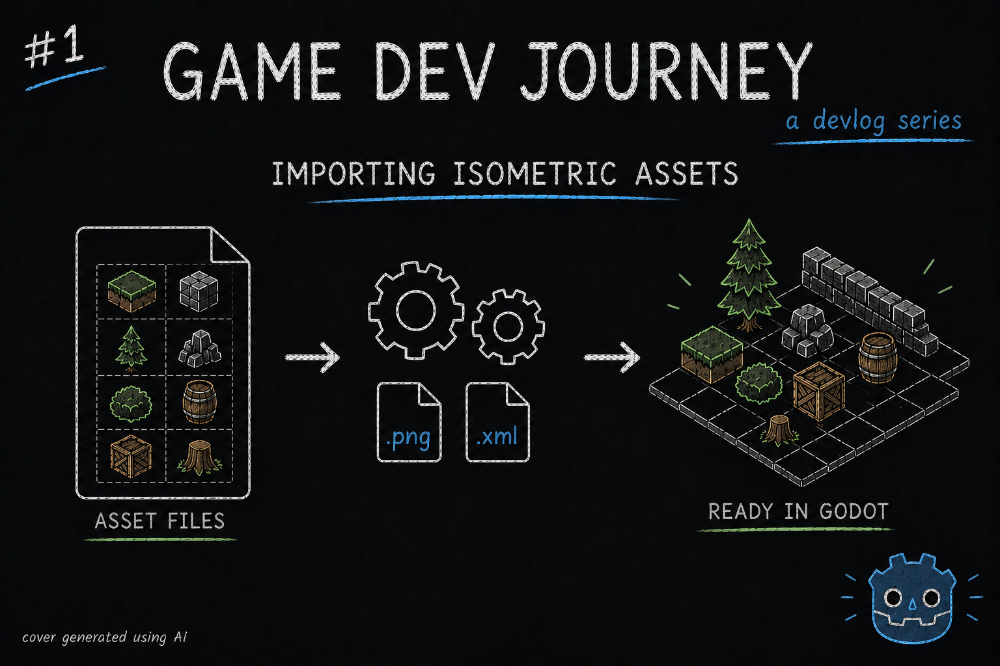
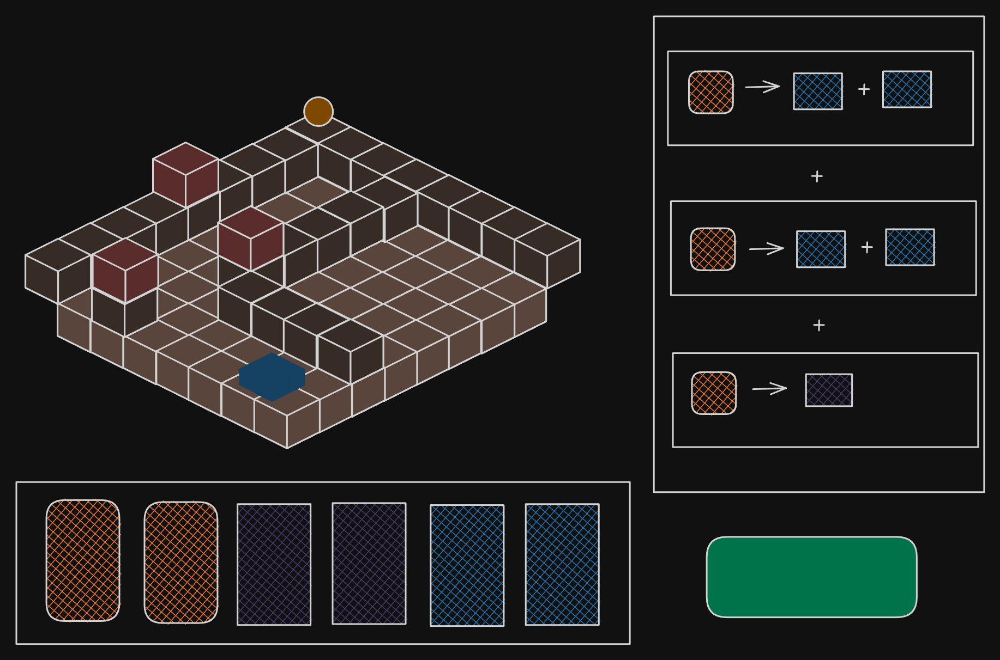
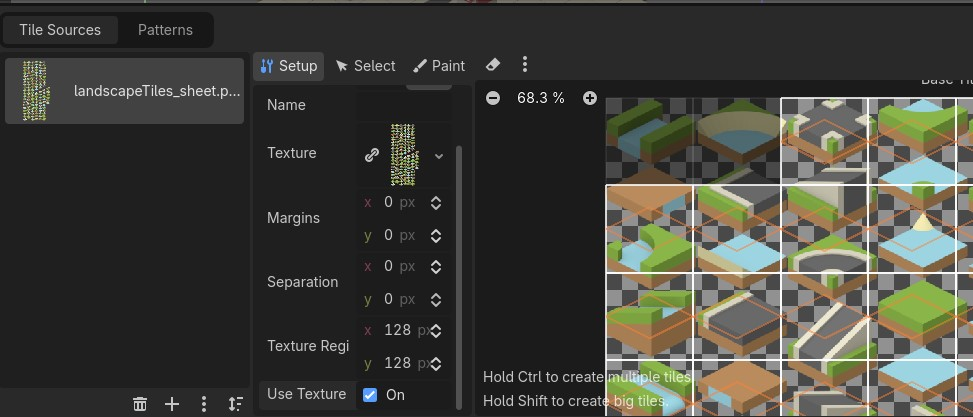
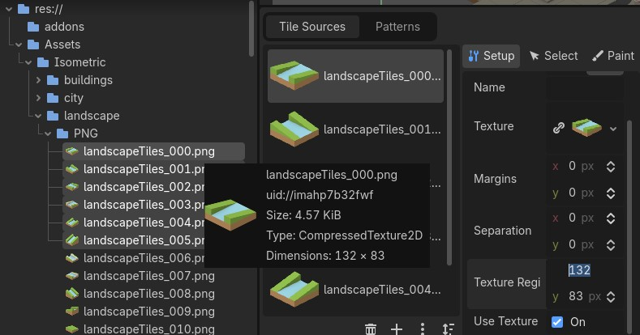
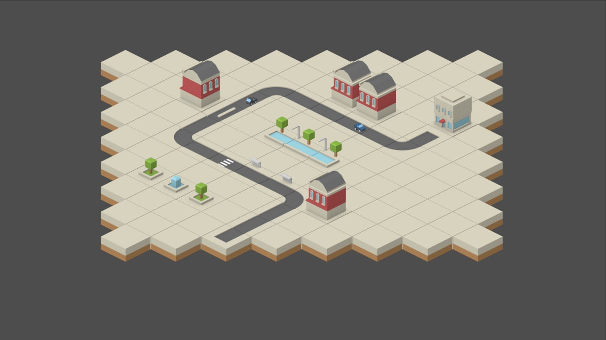

# Importing Isometric Assets

Greetings, fellow traveler. Have you ever struggled with importing spritesheet assets into Godot ? Perhaps you are looking into it and stumbled upon this blog post ?

If so, then welcome! This week I decided to search for a set or two (or four) of assets I could use as a starting point in **NanoSwarm: Dominion**, struggled with the importing process and managed to surpass my difficulties and create an example of a simple city in isometric style

For the concept of the game, the majority of the player's time will be spent in one of many procedurally generated cities (levels). But, before jumping into "how to generate a city", I should probably be able to create one manually. And, to do that, I need some visual assets. 

Luckily, the internet is full of visually appealing assets that can be used for free! Best of both worlds for someone like me, who can barely draw a convincing stickman. After a few searches, I crossed paths with [Kenney's Assets](https://kenney.nl), particularly the 2D isometric ones that, not only look great, but also close to the art style I had in mind originally, which is a double win in my book. (If you want the specific ones, I will add the links to the end of this post)

Since I was able to find these assets in such a short time, I decided to go ahead and try to create a "city sandbox" similar to the mockups I drew for this project, to see if they were a good fit.

> *You drew mockups ? But earlier you mention you could barely draw! Also, what are mockups ?*

I *can't* draw, correct. But I *can* have ideas! And mockups are just "sketches" of what a given thing (web page, form, character) should look like. Not the "actual", final visual.

There are a lot of tools online one can use to create mockups by drag and dropping existing elements from a toolbox onto a canvas. In my case, I used [Excalidraw](https://excalidraw.com). Free, runs in a web page and I already use it to draw technical diagrams on my regular job. Different types of drawing, sure, but I like this tool. So ... I thought I could use it for this too.

In any case, here's one of the mockup images. I posted this image (plus a few videos of a tech demo for this prototype) on my [X Profile](https://x.com/ApprenticeCodex), in case you're curious.

## How to import 2D assets

Now, I got some assets and I know what I want to create. Time to import them into Godot! As per usual, there's not "one" single way of doing things, but after reading some documentation and watching some tutorials online, here's the gist of what I found:
- To create a "map" in a 2D space, we have the node **TileMapLayer**
- If we want to add multiple layers/"heights", just gotta add more **TileMapLayers**
- Each **TileMapLayer** needs one **TileSet**. 
  - These come in all shapes and sizes, literally. We can pick shapes like "Square" and "Isometric" and set the size of each 'cell' in the grid
- After creating the **TileSet** resource, we can add our assets in the respective TileSet panel
- Easiest way of adding multiple assets is by adding one big image (spritesheet) with all the assets neatly organized in rows and columns. Also works by adding multiple images (one per asset) into one **TileSet** to bundle them together
- After setting up the **TileSet**, we can start placing individual tiles onto the world by using the tools in the TileMap panel

> *Doesn't seem too hard. And this Kenney Assets do come in both variants, so I just gotta add the spritesheet.png and I'm done, right ?*

Well ... About that. I spent an hour or two scratching my head because I couldn't finish creating my **TileSet** with the "neatly organized" assets in the spritesheet image. I kept adjusting the tile size, the texture region size, toying with the tile layout setting randomly in hopes of fixing it, and no luck.

See ? Not one tile is correctly aligned.

> *Dammit! Are you telling me these assets are broken ? Then why would you write about them ?!?*

The assets are not broken. It's a bit more complicated. Turns out, the `spritesheet.png` also comes paired with a `spritesheet.xml` file that contains instructions for the engine to properly "interpret"/import the image ... For Unity. And I am not using Unity, I'm using Godot. 

After *more* online searches, sprinkled with a few questions to ChatGPT to see if it would hallucinate a happier answer, I learned that Godot works "best" (at least, for beginners like me) when you use an image where all the assets are organized with the same width/height bounds. You *can* still use the image, but have to correct stuff manually. Which ... is a chore.

So ... after *even more* searches, here are the options I found:
* "Find a Godot addon that is able to import this two files."
* "Just use the individual PNG files"
* "Create a python script or something that creates a new image with fixed sizes"

I tried the addon path. I either found addons for older Godot versions, or ones that didn't work as intended. I'm not well versed in python too. So ... The individual PNG files it is.

> *Not what I was expecting, but hey. As long as it works. And how do I do that ?*

## Importing PNG files into a TileSet

Here's the simple walkthrough, step by step :
* In your Scene, add a **TileMapLayer** node to the root node (I used a plain **Node**)
* In the Inspector panel (by default, on the right), click on the *TileSet* property and create a new TileSet
* Click on the newly created **TileSet** and adjust the *Tile Shape*, *Tile Layout*, *Tile Offset Axis* and *Tile Size* based on the assets you got
  * In my case, I changed the shape to "Isometric" and the size to 128 by 128 (for the "big" tiles)
* In the TileSet panel (by default, on the bottom), click on the plus (+) icon to add the PNG files.
  * Also works by dragging the files from the FileSystem panel onto this one

* Now, for each image, make sure to fix the *Texture Region* to match the PNG actual size

* If you're using Isometric assets (I am), go back to the TileSet panel and change the *Tile Size* **Y** property to be half of the original value. So, 128/2 = 64
  * You can actually write "128/2" on the box the it calculates it for you

* Bonus : When you are done, you can "merge" the final result into one big "correct" image by clicking on the three-dot button in the TileSet panel, then click on *Open Atlas Merging Tool*
  
And congratulations! You can now use your newly crafted **TileSet** to create a pretty lake! Or a pretty city, in my case.

> *This does work! But ...*

It was tiresome ? Yeah ... the happiness I got from being able to make this work didn't last a lot, too.

However ... While all of this was happening, I actually was able to "recruit" a friend into tagging along this journey with me! 

> *Neat! Now you can import the PNG files twice as fast!*

Ah! If only! But no, he had a more "interesting" idea. Remember one of the options above ? The one mentioning a script to create a new image ? 

Together, we were able to create a quick tool that did just that! We feed it the path for the `spritesheet.png` and `spritesheet.xml` files, pick a name for the soon-to-be-created file, run a command and ... presto!

Not only it creates the `.png` file, we also managed to make it create a **TileSet** resource too! So, with that in mind ...

## Importing a TileSet resource

After managing to generate **TileSet** resources as starting points, my workflow shifted to: 

* Add the **TileMapLayer** node
* In the Inspector Tab, click on the *TileSet* property and quick load the generated file

And that's it! Much, much quicker!

> *Wow, that sounds great! And where can I find that magical tool of yours?*

Well, we made the script work "just" for what we needed, so it *may* not be ready to be used in "any" workflow.

> *But ... The quick load sounded nice ...*

I'll tell you what. Let me know you would like to use it, and we will polish it and create a standalone repo for it.

Now, with this matter settled, let's try and use the assets!

Here's the example of a city I created using the assets. It's nothing much, but ... It's a stepping stone.

And ... that's all my progress so far!

For those that read up to this point, if you'd like to see the Kenney's Assets I used, here's the links:
- [Isometric Tiles Buildings](https://kenney.nl/assets/isometric-tiles-buildings)
- [Isometric Tiles City](https://kenney.nl/assets/isometric-tiles-city)
- [Isometric Tiles Landscape](https://kenney.nl/assets/isometric-tiles-landscape)
- [Isometric Tiles Vehicles](https://kenney.nl/assets/isometric-tiles-vehicles)

Hope this blog post was helpful in any way.  
Got a question or just wanna discuss something? Feel free to reach out!  
And thank you for reading!