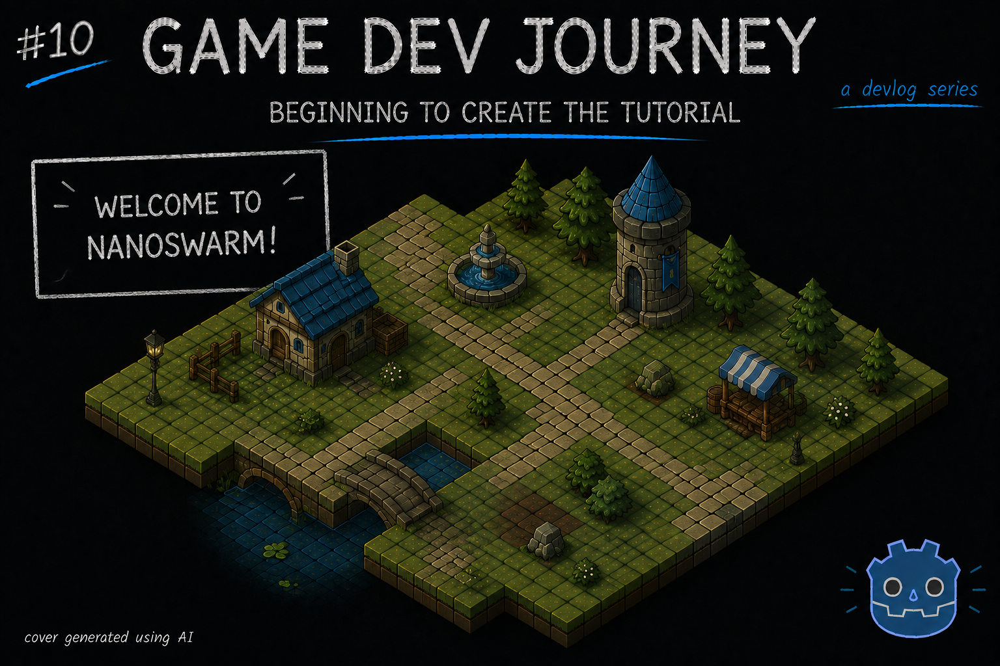
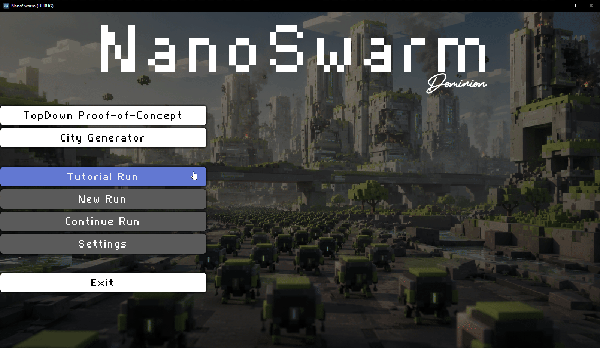

# Beginning to create the Tutorial

Greetings, fellow traveler. Have you been creating components for your game ? Need an idea on how to "start" wiring them together ?

I am in the same boat! In this week's (short) blog post, I write about why I decided to start creating the "tutorial" for my game, using the elements I've been creating so far and reusing a few others from previous prototypes.

Up until this point, I have created the first version of a few core components that are necessary for my game. I got a "City" scene with its layout, some basic "Turrets" and a "SwarmUnit" that's able to move around the map. Still very early in the process, with a lot of features missing, but they are there. However, all of these have been "inside" a sandbox-like environment where I manually spawn what I need in order to test it's functionality. Can't exactly call that a "game".

After my last update, I reached a point where I was not sure of what the next immediate step should be. There are a lot of things to be done, sure. But I had to pick *one* as to not overwhelm myself. And I decided to do ... **a tutorial**.

> The tutorial ? Over implementing all those missing features ?

Yes. I've put some thought into it, and I realized that by creating a tutorial - even a simple one - would allow me to better show (and perhaps share?) what the game is supposed to be and not to be. It will also require me to make sure that the core features of each entity are working (with me doing detours to implement them if not) and, the best of all, I would end up with a "vertical slice" of my game.

> Okay, I see where you're going. Where do we start ?

That's a great question. I am still figuring it how as I go, but in the meantime the goal is to create a "tutorial" city. I will be using a static, pre-generated map (so that I can focus on other aspects) and it will have one Turret and a small group of units. And it will feature a (very) small list of skills for the player to try out.

It's still far from "finished', but at the time of writing I was able to:
* Create a "tutorial city" scene composed of my "City" scene plus some `Control` elements for labels and such.
* Started refactoring some code around the "City" for ease of use
* Brought a small "State Machine" system from a previous Godot prototype and I'm using it to aid me in the "City" logic organization. It allows me to create states like "Plan Phase" and "Map Load"

I'll go more in-depth on each component I create/improve as I finish them but, for now, here's a small tease:

And... That's all I've got this week.

> Wait, that's it ? You won't even explain the "state machine" thing ?

In a future blog post, don't worry. However, if you're that curious... Check my earlier blog posts. You might find something.

Hope this blog post was helpful in any way.  
Got a question or just wanna discuss something? Feel free to reach out!  
And thank you for reading!