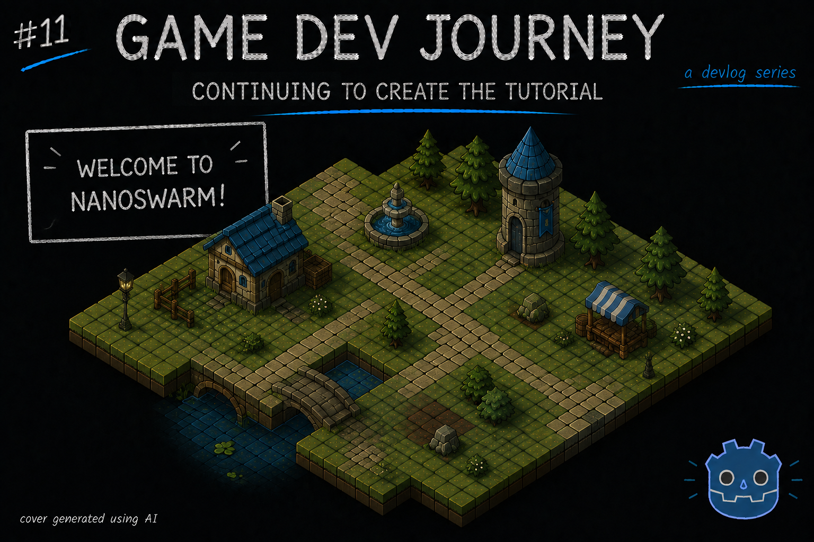
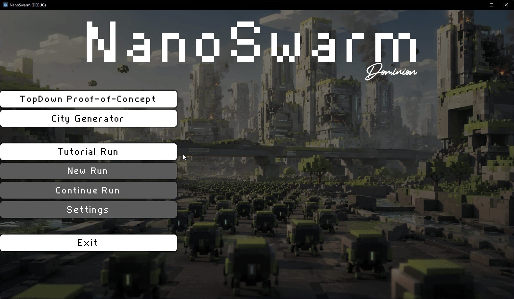

# Continuing to create the Tutorial

Greetings, fellow traveler. Here to see how my Tutorial level is going ? Perhaps looking for some tips or ideas ?



Whatever the case, welcome! In this blog post, I give a quick summary of my current standing in the Tutorial goal I set up for myself, as well as sharing some thoughts about the kinds of challenges and components I may need to create.

Keeping this blog post on the shorter side, since I am still in the process of creating "the" tutorial I have mentioned in the last post. With that, there's a lot of sections I am moving left and right until I get it right. Until this section is done and "ready to be shown", expect a few more posts to be like this.

> Makes some sense. As long as I keep getting my weekly updates

Doing what I can :)

In order to create a "good" tutorial - or at least, a good tutorial "technically" - I had to think how a regular city level would behave normally. Which, as I mentioned before, had me start modeling the different kinds of "states" a city could be in and implementing a `StateMachine` around it. When starting a new level, the city will go between an initial and a final state, changing it's behavior and how it presents itself as it changes states.

In logical order, I have sketched something like:
* An "Idle" state which acts as the initial state
* A pair of "Map Loading" and "Map Generating" states
* A "Plan Phase" state that the player interacts with
* A "Conquer Phase" state where the action unfolds
* A "Combat Results" state which also acts as the final state

These states are important to keep in mind because - as I understand it - the Tutorial should be able to "play" when reaching a given state. This is less of a concern for the "first big tutorial" level, since those are usually done by hand and static, however, it is a very common pattern to have "dynamic" tutorial segments appear as the player progresses through the game. Especially in a game where items or events are randomly placed, so two players may encounter some mechanics at different times in their playthroughs.

> So some tutorials should appear in the "Plan Phase" and others in the "Conquer Phase" ?

Exactly. Bonus points if we're able to show or hide elements as the player clicks on the "next" button in the tutorial.

With this "side quest" in mind, I think I want to create something that allows me to make "smaller", multiple tutorials with some kind of "trigger" condition. For now, I got a super basic version of this implemented just to be able to "see" some progress. I got a big box with a label and a button to do the "tutorial dialogue" component. When the player clicks the "next" button, it goes to the next step until it reaches the end, at that point it hides itself.

Again, very basic implementation, but it was enough to spark some ideas as to what I will need and not. Right now, it looks something like this:

```
var steps = [
	{label = "Welcome to\nNanoSwarm : Dominion!", spawn_swarm = false, plan_phase = false},
	{label = "Your goal : Reach the (blue) Core\nand conquer this City", spawn_swarm = false, plan_phase = false},
	{label = "For that, you control a swarm\rof NanoBots that act as one unit", spawn_swarm = true, plan_phase = false},
	{label = "Every City employs their own\ndefenses - Turrets, Traps, etc", spawn_swarm = false, plan_phase = false},
	{label = "To overcome them, the NanoSwarm\nneeds to adapt to any situation" , spawn_swarm = false, plan_phase = false}
]
var current_step_idx := 0

# ...

func _on_next_btn_pressed() -> void:
	current_step_idx += 1

	if current_step_idx < steps.size():
		var stepInfo = steps[current_step_idx]

		$WelcomeDialog/MessageContainer/Label.text = stepInfo.label

		if stepInfo.spawn_swarm == true:
			_spawn_swarm.call_deferred()
		
		if stepInfo.plan_phase == true:
			city.go_to_plan_phase.call_deferred()

	else:
		$WelcomeDialog.visible = false
```

See ? Simple. But... It allowed me to get the tutorial screen look like this sample:



> It doesn't look half bad! 

Yeah, I know. But I bet it will look better once I am able to load this kinds of "steps" from a `Resource`, attach some fancy "zoom in" effects to highlight the important areas and maybe (somehow) connect this to the city generator, with a condition like "if this level contains a thing the player haven't seen it yet, trigger tutorial B10" or something.

> Ooh, that does sound neat!

Thanks! And with that amazing idea... That's all I got for this blog post!

Hope this blog post was helpful in any way.  
Got a question or just wanna discuss something? Feel free to reach out!  
And thank you for reading!