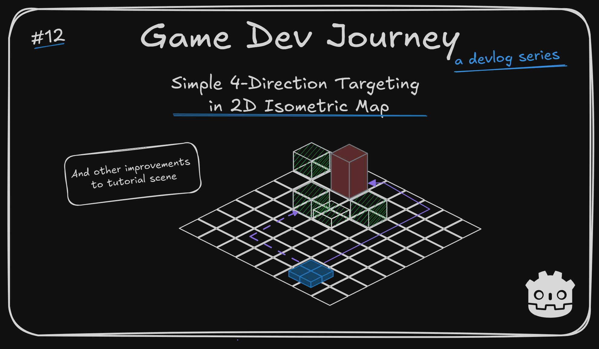
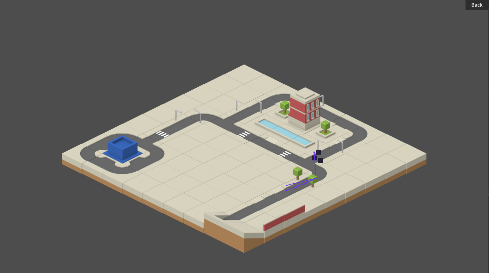
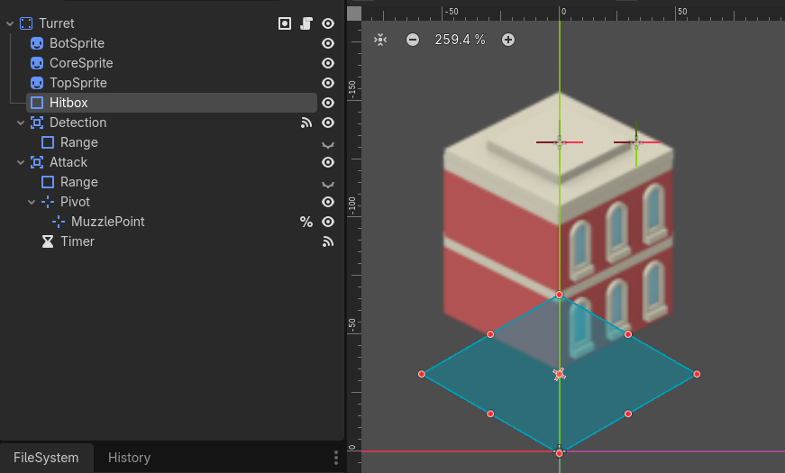

# Simple 4-Direction Targeting in 2D Isometric Map

Greetings, fellow traveler. Having trouble with choosing the correct point for your `NavAgents` to target ? Maybe you're just curious on how's the project going ?



If so, keep reading! In this blog post, I will focus on how I improved my unit's movement target position by choosing a "better" point, as well as giving a general update on my progress in creating a the Tutorial.

*Feel free to jump directly to the [simple 4-direction targeting](#simple-4-direction-targeting) section I wrote*

## General Tutorial Updates

Since my last update, my focus has been on adding (technically refactoring) more "content" into my Tutorial City scene. I have my main states "Plan Phase" and "Conquer Phase" implemented, and a *very* crude (but functional) version of the "Combat Result" state. Still need a lot of work, but at least I can now show the "main loop" of a level : The player loads into a City, spends some time crafting a strategy, watch the combat unfold and sees a 'Victory' (or 'Defeat') result screen. 

Here's a quick video with how it looks, in practice:

[](https://youtu.be/PGKj3vJl5HY)

> Oh, it's starting to look like a game!

Ahah! I think so too! Still got *a lot* of work ahead of me, but it's a start.

For example, I am instancing the Turret and the Swarm units with hardcoded values for their stats (such as "damage" and "health") and the list of available Triggers and Actions is nothing more than a static function with a pre-defined list. Oh, and I still need to move my city map generation logic into the corresponding "Map Generation" State in my State Machine, so it weaves in nicely with the rest of the rules I got.

One of the components that is starting to "surge" during the development of this section - and that I saw highlighted in GameDev tutorials all over Youtube - is my own version of a "GameManager" singleton.

> A Manager ? Aren't we already "managing" code in every component ?

Sorta. We do implement small rules and interactions between two or three components throughout the game, yes. However, there are "core" rules or data (or even events) that you will need readily available pretty much in any component you're creating. So, it's nice to have a "central" place to have it all. Be it sharing data between different States (which I have) or being able to connect to an important `Signal` anywhere (which I haven't, but I am thinking on it). My implementation is still bare-bones, but perhaps down the line I'll write a blog post dedicated to the topic.

I am also starting to see the benefits of deciding to create the "Tutorial City" early. Not only it's great to show what I got planned, it also highlighted already which tasks need attention first. So, for what it's worth, I'd recommend considering this idea for your own projects.

> Really ? Is it that helpful ?

For me, at least, it has been. Here's an example (and also the "main topic" of this blog post). As you may remember, I have already implemented a simple version of path finding. Now, imagine how surprised I was when, during one of my first tests, I consistently saw this behavior:



Notice the purple path line. My units were targeting the turret and decided to just... Stop half-way there.

> That looks like a bug. Maybe you chose the wrong point in the map ? 

Thought the same, but nop. The units were going to the correct point in the map. It's more interesting than that.

My Turret (a `Node2D` scene) occupies a small square in the grid, but it has a single point of origin (the `position` property), which happens to be the turret's bottom left corner. And I was using that as my units' target. That works fine when the shortest path to that point was covered with navigation-able (is that a term?) tiles. But if that point happens to be covered with something like decoration tiles, then the calculated path that I got was stopping just before crossing those.

> Why didn't it just go around ? I can see road tiles there

Because if they did so, the units would still be one tile's worth of distance away from the target position. And since the tiles for a Turret foundation are not walkable...

> That would be a more expensive path, so they stopped short!

Yup. Took me an hot minute (or the better part of an hour...) to realize that. 

Which brings us to the next section:

## Simple 4-Direction Targeting

After dissecting all the information I had available to me, here's the problem I am facing: For my units to be able to reach a given Turret (or any Building), I need to choose a suitable `Vector2D` point in the map, depending on the nearby tiles in my multiple `NavigationLayers` and if they are walkable or not.

Since I am working on a 2D plane and using a square isometric grid, it means that I need to be able to approach any target from 4 directions: Up, Down, Left and Right.

> So, if we stick 4 points to the Turret scene we're good, right ?

A good starting point, but I'll try to do a little bit *more*. 

The general idea that I came up with is : 
- Use the `CollisionShape2D` node (which I already have set up) to double down as the "perimeter" of our Turret
- Create 1 point for each side. Since I am using a `RectangleShape2D`, that will be 4 points
- Filter out the points that are **not** next to a Road tile
- Pick the one  closest to our unit's position

Sounds simple enough ?

> Following along so far

Neat! Then I'll keep going by highlighting the important steps I did.

First things, first: Ensuring the Turret's `Node2D` scene has a suitable `CollisionShape2D` (I named mine "Hitbox"). Since I am creating a 2D Isometric game, I have aligned the Hitbox area to match the "ground floor" square tile that it occupies visually. I have also tweaked the properties `Rotation` and `Skew` to 30 degrees, to match the Isometric style I chose.



Then, on the script side of things, I included 4 basic booleans to indicate whether a given side has a walkable tile or not, and a basic method that returns up to 4 points, derived from the Hitbox's shape. Here's the snippet: 

```
@export_category("Placement")
@export var top_side_access : bool = false
@export var right_side_access : bool = false
@export var bottom_side_access : bool = false
@export var left_side_access : bool = false

#...

func get_reachable_perimeter_points() -> Array[Vector2]:
	var hitbox_rect : Rect2 = $Hitbox.shape.get_rect()

	var side_points : Array[Vector2] = []

	if top_side_access :
		side_points.append(to_global(Vector2(hitbox_rect.position.x , 0)))
	if right_side_access :
		side_points.append(to_global(Vector2(0, hitbox_rect.position.y)))
	if bottom_side_access :
		side_points.append(to_global(Vector2(hitbox_rect.end.x , 0)))
	if left_side_access :
		side_points.append(to_global(Vector2(0, hitbox_rect.end.y)))

	return side_points
```

And lastly, on my existing code that assigns the target position to my units, all I have to do is pick the closest one (Godot has methods to quickly do that math). Something like so : 

```
  var candidate_target_positions = turret.get_reachable_perimeter_points()

	if candidate_target_positions.size() > 1:
		candidate_target_positions.sort_custom(func (a, b): return a.distance_squared_to(position) < b.distance_squared_to(position))
	
	target_position = candidate_target_positions[0]
```

There! Simple solution for a simple(?) problem.


Now my units correctly take the "long" way around, like I intended to. Further into the project, I am already planning on improving this solution by adding support to multiple points on each side. It will tie in nicely to some mechanics I have wrote down.

> Oh really ? Like what ?

I will tell you... When I implement them. For now, I think that's all I got to write about.

> Wait! You're not even mentioning the new cover images ?

Oh, that. To keep it short : The ChatGPT project I was using to generate the cover images (since I am bad at art-related stuff) decided to fail on my. And, instead of fixing it, I decided to just do them manually for now. And I *might* create some tool that takes a template + some text inputs for the title and the like and generates them in the future. *Maybe*.

Hope this blog post was helpful in any way.  
Got a question or just wanna discuss something? Feel free to reach out!  
And thank you for reading!