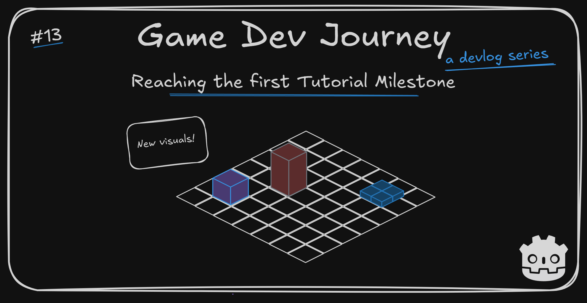
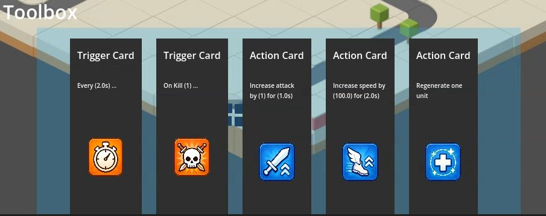
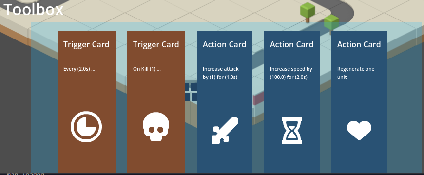
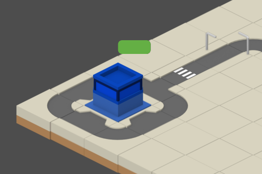

# Reaching the first Tutorial Milestone

Greetings, fellow traveler. Back to check on my most recent developments ? Maybe wondering what the little squares are moving towards to ?



Wonder no more! In this week's blog post, I quickly showcase the new visuals for the Triggers and Actions, introduce the newly introduced "Core" `Node` and highlight a small component I really like - the health bar!

## New assets acquired
During the recent developments, one thing that stood out to me were the placeholder icons I was using for the "card-like" visual representation of the sample Trigger and Actions I implemented for the game.



They "work", in the sense that they represent what they are supposed to (example : the "clock" for the timer trigger card), but they are a bit ...

> Ugly ? Small ? Don't match with the rest of the assets ?

Pretty much, yeah. When I first started the project and did the first "proof of concept", I did not had asset lying around. So I searched a few ideas online, threw them into the nearest ChatGPT chat window plus the colors I wanted to use, and ... That's what it gave me.

> AI assets ? Really ? 

It was a prototype! I did not want to spend money on something to then throw away if the idea wasn't fun. But, I have no need for this assets anymore!

Recently, Kenney (the author of the free assets I use for everything else) had a really good deal on his ["All-in-1 Game Assets"](https://kenney.itch.io/kenney-game-assets) bundle, which I've been eyeing for a bit now. So ... I bought it! It has *a lot* of assets, including icons! So, after a few replacements and color changes, I got this improved version working:



> Oooh, it looks way better now! 

Thought so too! For the icon itself, it was just a matter of replacing the source file in the `Texture` node I am using. And for the background, I just took a shortcut and added 2 `ColorRect` to the main scene (each with it's own color), then I just toggle between them depending on the data I receive to render the card.

Later down the line, I hope to use more of this bundle's assets on the game. To keep the game style consistent throughout.

## New "Core" Building

Until now, the little square units were moving either towards a nearby turret (to attack it), or towards the "goal position". Which ... means nothing, by itself.

So, one of the recent additions was the "Core" building that is spawned on top on the "goal" foundation (pretty much like how I spawn the Turrets) and acts as the `Node` that all units target when not engaged in any other action.



> It's ... a building

It may not look like much - partially cause I am lazy. I just took an existing building visual I had and used the `modulate` property to make it blue - but it allows me to doa couple of things :
- Improves the "goal targeting" vs. the plain `Marker2D` I was using, using the same exact approach I wrote in my previous blog post
- It gives the units "something" to do (attacking, for now) before achieving the "Victory" condition, instead of a boring "first unit reaching this invisible point triggers a win".
- And a few more things, later in development

And it was pretty much straightforward to create. Took more than a few minutes, since I had to tweak a few elements (like updating the "map load" and "map gen" states to include spawning this `Node` ), but all of those were simple to do.

After wiring everything up - including adjusting the "win" trigger - it looks something like this : 

[](https://youtu.be/AYwSIuzZFYw)

> It works, neat! Also, where did that HP bar came from ?

Oh, that ? It's just a simple `ProgressBar` node. Nothing *too* impressive in that regard. What *is* cool about it it's how it is "attachable" to other nodes.

> Attachable ? Explain

Will do!

## Small "attachable" Health Bar

If you played any game ever, chances are you know what a Health Bar is. And if you followed any game dev tutorial, you probably already created one or two basic health bars. Just grab some visual component - in this case, a `ProgressBar` node - and change it's current value up or down whenever update your hp value. Simple enough.

What I like about *this* implementation in particular is a very simple trick that allows me to use this exact component on *any* entity in my project that has "health" as a concept. 

In short, what I did was :

- Create a custom `Resource` named "Health", with properties such as "total" and "current" hp.
- On any entity I want health, I add a property of type "Health".
- Create the custom "HealthBar" component, using the before-mentioned `ProgressBar`
- On any entity I want a health bar, I add an instance of the "HealthBar" as a **child** Node

The "magic" is in the HealthBar's script. I wrote code so it checks if the `parent` node contains the "Health" `Resource` and, if it does, attaches all the needed events to make it function like clockwork

> And... You wouldn't happen to be willing to share such an amazing script ? 

Since you asked nicely, imaginary-voice-in-my-head, sure!

Below I will add the script for both the "HealthBar" and "Health" components. The rest I will let you figure out : 

```
extends Resource
class_name Health

@export var current: int = 1
@export var total: int = 1

signal on_health_changed(new_health: int)
signal on_health_depleted()

func change_health(amount: int) -> int:
	current += amount

	on_health_changed.emit()
	if current <= 0:
		on_health_depleted.emit()
	
	return current
```

and ...

```
@tool
extends ProgressBar

var parent: Node
var health: Health

func _ready():
	parent = get_parent()

	if parent == null:
		push_error("HealthBar must be a child of a node with a 'health' property.")
		return
	
	var health_property = parent.get("health")
	if health_property == null or not health_property is Health:
		push_error("Parent node must have a 'health' property of type Health.")
		return
	
	health = health_property

	max_value = health_property.total
	value = health_property.current
	health_property.connect("on_health_changed", Callable(self, "_on_health_changed"))

func _on_health_changed() -> void:
	value = health.current
```

Remember, this approach is not "reserved" to health bars in any way! You may be able to apply it to a hundred other use cases! Try to understand what's happening, instead of just copying and pasting :) 

And with that little note, I think it's a good stopping point for this blog post.

Hope this blog post was helpful in any way.  
Got a question or just wanna discuss something? Feel free to reach out!  
And thank you for reading!