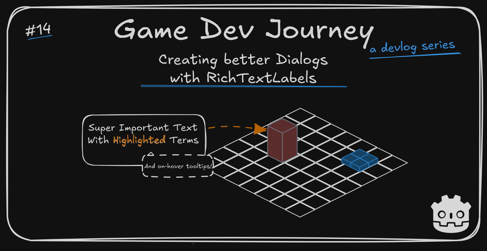
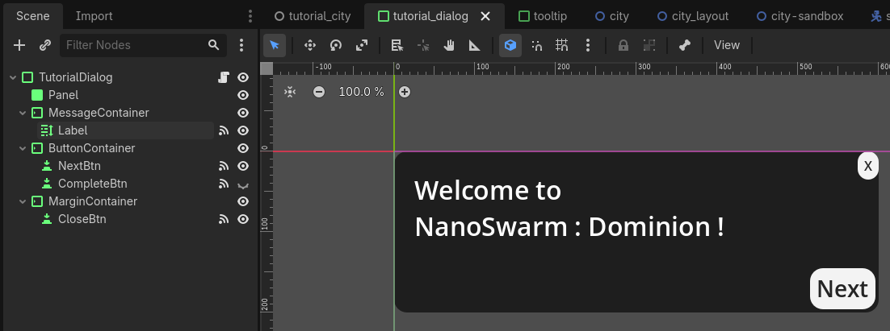
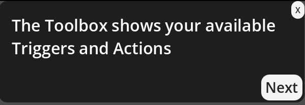
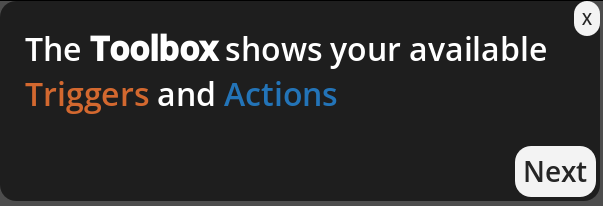

# Creating better Dialogs with RichTextLabels

Greetings, fellow traveler. Looking for ways to improve your text boxes ? Maybe ideas on how to improve your game clarity ? Or saw the title and got curious ?



Then this might help you. In this week's blog post, I show you the improved "Tutorial Dialog" component I implemented and talk briefly about the next planned changes.

Initially, my goals for this week were a tad bit different. I did plan to work on improving some components, yes, but most would be 'behind-the-scenes' ones, with "Tutorial UI" being just one of them. Sadly, I ended up with less time on my hands than I'd like to. So I focused on *one* thing of the original list : Improving the usability - from a developer POV *and* a user POV - of the bare-bones "Tutorial Dialog" I introduced a few weeks back.

> What made you pick this component, then ?

Because ... it was the first item on the list. Plain and simple. The original plan was :
- Transform the bare-bones "Tutorial Dialog" into a proper(ish) component
- Improve my City component to have a singular, data-driven, "entry point"
- Integrate the "Tutorial Dialog" into the City, to grant *any* city the ability to show tutorials, instead of having dedicated "Tutorial Levels".

This was a good plan, I think. It would allow me to pause the development of this section in a good-enough state and focus on adding a new element to the game. But, like I mentioned, wasn't able to. Hence the focus on the first item of the list.

> I can understand that. So, what are we doing with the Tutorial thing you mentioned ?

A great question. When I first talked about it, I shared the main goals I wanted for it as well as a rough code snippet, using a Dictionary of values and a few random variables. A small mess. The important info to retain is this: 
- I want to create multiple "tutorials" that can be shown at different times in a given City (level)
- Each "tutorial" is a collection of steps, where each step has the informative message plus any metadata we may or may not need
- The "tutorial" is shown in a basic "dialog-style" box that the user can interact with

Nothing too out-of-the-box. And the basic version I implemented worked. But it's in no way a "good" component.

"The tutorial's text was hardcoded in the code, and I will need more than "one" tutorial. The `Control` nodes were created inside a test tutorial scene, but what if I want to show a tutorial elsewhere ? I was only able to render plain text, and I really like to **highlight** words and give them a little *nudge* sometimes. So that should also be supported." And so long and so forth.

With all those concerns in mind, I researched what kind of Nodes Godot gives us to achieve all of this (or even a part of this) since I don't like to re-implement the wheel unless I have to. And luckily, I found the [RichTextLabel](https://docs.godotengine.org/en/stable/classes/class_richtextlabel.html#class-richtextlabel) node. It's essentially a `Label` node, but it allows us to enrich the text we add to it using Godot's [BBCode](https://docs.godotengine.org/en/stable/tutorials/ui/bbcode_in_richtextlabel.html) syntax.

Having discovered this node, a quick plan was created :
- Create a new "TutorialData" custom `Resource` to hold all the info we want for a given tutorial
- Create a new "TutorialDialog" custom `Scene` where we design the Dialog-style visuals
- Wire it all together and test it in the Tutorial City.

Won't focus on the "wire it all" step that much, since that resides in the section I wanted to improve anyway on my original plan. But I will focus on the other two.

## Creating the TutorialData Resource

As with any custom Godot `Resource`, the goal is for it to hold all the relevant data we need for the concept we want to represent - in this case, the "Tutorial". This will change from game project to game project, of course. I am using this section to briefly talk about "what" I chose the include and "why", since the thoughts behind it may help someone.

One of the first properties is a list of "steps", which I believe is fairly common. Instead of having one giant wall of text, I can break the tutorial in small digestible chunks. One not-so-common property I am adding, however, is the "trigger" property, which I am planning on using to control 'when' in a level I want to show the tutorial. It pairs well with the StateMachine pattern I tend to use.

Here's a snippet of the base version of the class. Modify as you see fit.

```
extends Resource
class_name TutorialData

@export var id: String
@export var trigger : Trigger 
@export var steps : Array[Step]

func _init(_id: String, _trigger: Trigger = Trigger.None, _steps: Array[Step] = []) -> void: 
	id = _id
	trigger = _trigger
	steps = _steps


enum Trigger { 
	None = 0,
	OnMapReady = 1,
	OnPlanPhaseReady = 2,
	OnConquerPhaseReady = 3,
	OnCombatResultsReady = 4,
	OnManagePhaseReady = 5,
}

class Step extends Resource:
	var text : String

	func _init(label_text: String) -> void:
		text = label_text
```

As you can see, nothing that special. I even represented the "trigger" property I mentioned as a enum, for ease of use.

Quick note : If you want to use a second class as the type for one of your properties (look at the "steps" array), don't forget to also mark that class as a Resource too. Otherwise Godot will warn you that it can only serialize (read : use) simple types or other `Resource` types when storing and reading from file. The syntax also shifts slightly if you want to declare both in the same file, so I included it in my example

## Using Godot's RichTextLabel

Now, for the visuals. I chose a very simple approach for this because, honestly, I am not that good at "UI" elements. So I am sticking with plain buttons and text with black and white colors (most of the time).



See ? Very basic elements. I am using a `PanelContainer` as my base, with `Buttons` and a `RichTextLabel` for the main elements. And a few `MarginContainers` so the elements don't render too close to each other.

The `Buttons` should be self-explanatory : One to dismiss the tutorial at any time, one to go to the next step and one to "complete" the tutorial (by closing) when I am at the last step. The important node is the `RichTextLabel` (named Label, since I ran out of creativity).

> You keep saying this node is important, but I gave it a go and it just renders text. Same as the `Label` one

Then allow me to highlight the cool parts. And keep in mind, I am no expert with this. At the time of writing, I've spent no more than 2 or 4 hours fiddling with it.

The `RichTextLabel` allows us to render "plain text" by default, but it allows us to do *more* once we toggle on the `BBCode Enabled` property in the `Inspector` panel. [BBCode](https://docs.godotengine.org/en/stable/tutorials/ui/bbcode_in_richtextlabel.html) is Godot's syntax to enable us to style the text by using particular "tags" to wrap the section we want to style. It looks like a mix of HTML and Markdown, if you ask me.

It can take make your text go from this :



To this, using the correct tags :



> Ooh, it looks way better. Then why isn't BBCode enabled by default ?

No clue. Seems a weird choice, since there's already a separate `Label` node. But I won't complain.

Once I got this node structure going, all that's needed is attaching a script that will receive a "TutorialData" instance and handle the data reading and value setting bit.

Here's what I am using currently. As usual, tweak it to your needs.

```
extends PanelContainer
class_name TutorialDialog

signal on_tutorial_end(closed: bool)

@export var data : TutorialData

@onready var textLbl = $MessageContainer/Label
@onready var completeBtn = $ButtonContainer/CompleteBtn
@onready var nextBtn = $ButtonContainer/NextBtn
@onready var closeBtn = $MarginContainer/CloseBtn

var _total_steps : int = 0
var _current_step : int = 0

func _init() -> void:

func start() -> void:
	_handle_current_step()

func _handle_current_step() -> void:
	var step = _get_step()

	textLbl.text = step.text

	var last_step : bool = _current_step + 1 == _total_steps

	completeBtn.visible = last_step
	nextBtn.visible = !last_step
	closeBtn.visible = !last_step


func _get_step() -> TutorialData.Step:
	return data.steps.get(_current_step)

func _on_next_btn_pressed() -> void:
	_current_step += 1

	_handle_current_step()

func _on_close_btn_pressed() -> void:
	on_tutorial_end.emit(true)
	self.visible = false

func _on_complete_btn_pressed() -> void:
	on_tutorial_end.emit(false)
	self.visible = false
```

I even took the liberty to add a "on_tutorial_end" event that triggers when the tutorial is completed. May be useful later. I also make distinction between dismissing the tutorial and actually completing it, in case I want to implement something like "if level 1 lost and player dismissed tutorial, poke fun at player". Or not.

## Add On-Hover Tooltips with RichTextLabel

This section is a small "extra" on top of the base I built in the previous two sections. If you want, you can scroll down first to see the final result and then scroll back up. Or just keep following along. Both will work.

After building and testing this tutorial / component, an idea came up : What if I added those fancy tooltips that games like "Path of Exile" and "Baldur's Gate 3" have ? The ones where the important keywords are highlighted and, when you mouse over them, a tooltip with the explanation appears ?

> Oh, those are awesome! But surely they are hard to implement... right ? 

Well... To implement a *flawless* version with all the keywords you will ever need, for sure it is hard to get it right. However, to implement an initial version in Godot ? With two or three keywords ? Turns out, not that hard. In fact, it took me less time than writing this dev blog.

> Now you're just showing off!

Perhaps. Or perhaps it's really that simple. One of the two, surely.

If you check [this section](https://docs.godotengine.org/en/stable/tutorials/ui/bbcode_in_richtextlabel.html#handling-url-tag-clicks) of the `BBCode` syntax, you will notice that Godot devs mention "advanced use cases" with inline data. Join that with the `RichTextLabel`'s `meta_hover_started` and `meta_hover_ended`, plus a new `Scene` for the tooltip itself (I duplicated the "TutorialDialog" and removed the buttons) and a place to store the information that should appear in that tooltip, and you got yourself some fancy contextual tooltips!

Bellow I'll include the important snippet that makes it all work. If you've been following along, I am sure you can piece the rest together :

```
# Pretend for a minute this comes from a file
# or is in a pretty singleton with a dictionary
var term_dictionary = {
}
var tooltip_instance : Node = null

func _on_label_meta_hover_started(meta: Variant) -> void:

	if tooltip_instance != null : return

	var json = JSON.new()

	var error = json.parse(meta)
	if error != OK: return

	var termProp = json.data.get("term")

	if termProp == null: return

	var termText = term_dictionary.get(termProp, "")

	if termText == "": return

	var tooltip_scene = preload("res://Components/HUD/tooltip.tscn")
	tooltip_instance = tooltip_scene.instantiate()
	var lbl = tooltip_instance.get_node("MessageContainer/Label")
	lbl.text = termText

	var cursor_positon = get_global_mouse_position()
	tooltip_instance.position = cursor_positon

	get_parent().add_child(tooltip_instance)
```

## Putting it all together

With all of these components built, testing them together is straightforward. Create a sample instance of the "TutorialData", pass it to an instance of the "TutorialDialog", see what happens.

Here's a quick video, showcasing the final result
[](https://youtu.be/4wo-pN52NXY)

And with that, I got nothing more to write about this week.

Hope this blog post was helpful in any way.  
Got a question or just wanna discuss something? Feel free to reach out!  
And thank you for reading!