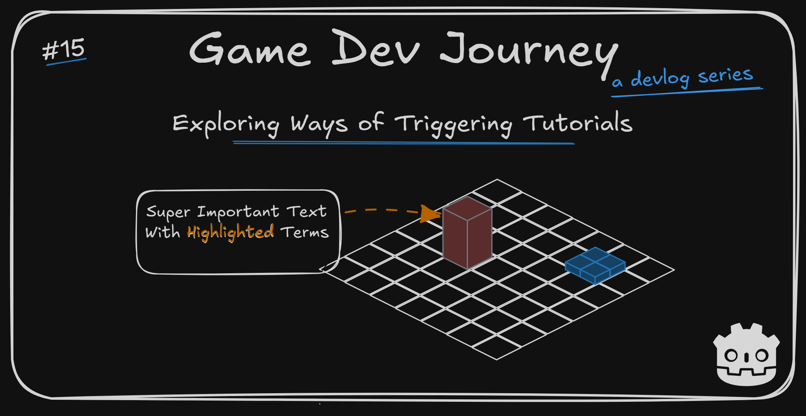

# Exploring Ways of Triggering Tutorials

Greetings, fellow traveler. Curious for different ways of evaluating when to show a tutorial to player ? Or looking for new tricks in Godot ?

Then welcome! In this blog post I write about the experiments I did while creating a system that decides when to present a tutorial to a player as well as talking about an idea about this blog posts I want to try out.

## Testing changes to the blog posts

> Talk about changing your blog posts in a blog post ? Isn't that *too* meta ?

Probably so. Then again, I already pretend having a second person commenting throughout the post to help me articulate some points, so it's not that farfetched.

As for the change itself. It's nothing major, especially since only an handful of people actively read my posts. But I felt I should write about it nevertheless. 

Up until this blog post, I have been writing (almost) weekly blog post with my project's progress, and it has been really helpful! It is achieving most of (if not all) the goals I have for them : share what little I have learned so far and create a "positive feedback loop" that keeps me motivated to work on the project.

During this time, the blog posts I have created can sorta be separated in two categories: shorter, with mostly highlights of that week's progress; and longer, more explanation/tutorial-like tutorials where I write more details about what I developed, why I did it and an occasional code sample.

The longer blog posts, despite being more "useful" and more interesting overall, also take more effort for me to write. And I have been trying to write them in the same time period as the regular, shorter ones. Which... Takes a toll on me.

> Hum... How long do you take to write the blog posts ?

Depending on the length / amount of topics to cover, it can go from 1 to 3 hours. And I only write them on Fridays, the week day I reserved only for blog posts. So, I always write them in (mostly) one go.

So, in the interest of me not tiring myself out, while still keeping with the weekly posts (which I want to), here's the idea I will be testing out: 
* Weekly (still on Fridays), I post my shorter dev blogs with the weeks highlights. 
* Occasionally, I may also post the longer (more technical) posts as its own separate thing.

With this, I can keep writing the weekly posts about the project's progress (both for *me* and for those who are following along), while working every so often on the more detailed posts, for those who want to know in detail how I implemented a given component or solved a particular issue (who might not even be that interested in my game, which it's fair)

> Will the longer posts be locked in any way ? 

Not really, no. Everything I write can be read free of charge, since I want to share what I have learned while on this journey. 

In short : Still writing blog posts, weekly posts should always be short and sweet. Occasionally a longer, more focused one may appear.

## This week's highlights

This week the goal was simple : Create "something" that controls when a specific tutorial is shown during the game.

I had created this simple "Dialog-Style Tutorial" component that shows text, with text format support and highlighted keywords and tooltips. Now, I wanted to be able to create a few different configurations of these and configure somehow, somewhere, when they are showed. How they are "triggered".

The base idea was simple(-ish). When loading up a City level, a list of the relevant tutorials to be shown should be calculated and, in between City state transitions, check if I had any to show at that moment. 

> When you say it like that, yeah. Sounds simple.

And in reality, it is. I could have done something simple to achieve this, like having one boolean property per tutorial and checking whether I had shown it or not, and update stuff accordingly.

However... I like to create components. Intricate components. The kind that's build to last. And this week I was in a mood to test out stuff and see what I could do for this "simple system". And, to make the matter worse (or better?) I had not one, but two slightly different ideas for it.

So I decided to implement a draft version of both :)

> Two whole versions ? For a over-the-top component ?

Yes. My project, my rules.

So, to keep this short (or, trying to, as I wrote in the first part of this post), what were the two variations I came up with ? 

**Idea #1** : Each TutorialData `Resource` contain a "requirement" field. An expression that can be dynamically evaluated at runtime with Godot's [Expressions](https://docs.godotengine.org/en/stable/classes/class_expression.html) (here's the [examples](https://docs.godotengine.org/en/stable/tutorials/scripting/evaluating_expressions.html)). When generating a city, I'd cycle over each not-seen tutorial, evaluate against a contextual object and, for those who passed, add them to "the list" to be shown later on. This plus an enum to help me tell "when" in the City state machine to show them.

**Idea #2** : Each Entity or Component that needed a tutorial would have a property with a "tutorial id" of sorts. A link, if you will. From the full City scene, to a Turret entity, to a specific component that *may* be used in the Turret. When loading in a City level and instancing all the needed classes, all these "links" would check themselves if the tutorial they refer to was already seen or not and, if not, add it's data to "the list' to be shown later on. 

The two ideas work, both in theory and in practice. And each have pros and cons. 

For example, the first idea looks to be the more "powerful" one with its ability to define "any" criteria for a tutorial to be shown. Could be "be in level 4" or "Have 3 turrets spawned and have a swarm of 10 or more units, while on the X biome". But all of these needs to be supported in code, and the "expression" itself can be a dangerous tool (the Godot docs say so themselves). 

The second idea, however, is more simple in the "how" a tutorial is shown - just have the associated entity/component be present in the game for the first time - and its system was *slightly* harder to develop at the start. But it's way more "intuitive" to use in the editor. Can be configured either in the `Inspector` Panel (when dealing with a property in a `Resource`) or in the `Scene` Panel (when it's a child node). So, easier to just copy/paste or drag-n-drop.

> Both sound so interesting! Which did you pick at the end ? 

At the time of writing this, I... don't know which one I like more. Still need a day or two to think this through. But both were fun to implement. And, once again, both work! So, in case you're curious in any of them, feel free to try them yourself.

## Plans for next week

Next week should be *less* eventful. I want to pick one of the two ideas I talked about above, and fully implement it / integrate it in the rest of the components I got. Mainly the City scene. Will also quickly review / clean the City scene of any less-than-good aspects I got in preparation for the next component / stage I have in mind.

With that, it's the end of this short(er?) dev blog!

Hope this blog post was helpful in any way.  
Got a question or just wanna discuss something? Feel free to reach out!  
And thank you for reading!