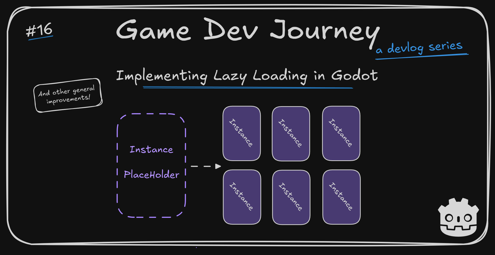
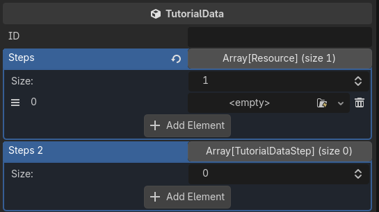
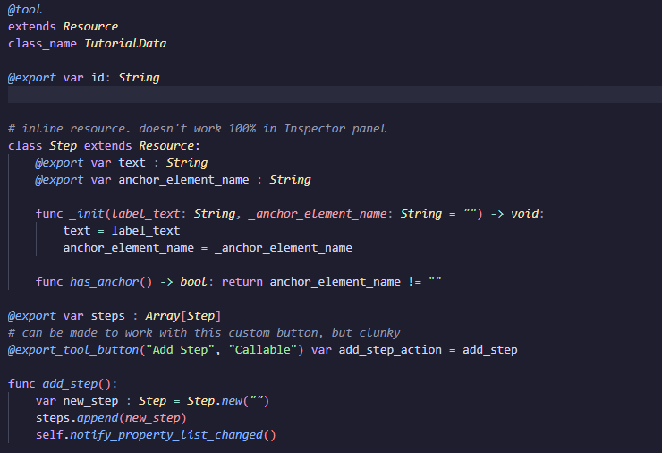
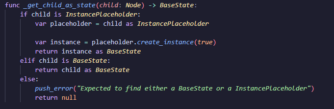
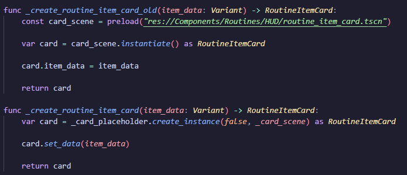

# Implementing Lazy Loading in Godot

Greetings, fellow traveler. Trying to make your scene's `Nodes` only load up when you need them ? Preferably without cutting on usability in the Godot Editor ? 

Well you're in luck! In this week's blog post, I write about Godot's `InstancePlaceholder` and how I used it to improve my existing game's components, an interesting interaction between nested `Resources` and the `Inspector` panel, as well as other general improvements that may be of interest.

## This week's highlights

Remember when I said something about this week having less content to talk about ? 

> I believe the exact words were "less eventful", yeah

Well... I ended up finishing up almost everything I had planned originally, and then some. I picked up the Tutorial system I mentioned earlier, finally decided on which approach I would stick with (spoiler : it was idea #2 - the "tutorial link" one) and finished up that implementation by including data loading from files (using Godot's `ResourceLoader`) and cleaning up code in general. Oh, and even hit what seemed to be a Godot limitation with `Resources`. That was "fun".

### Plain Resources vs. Nested Resources

> A Godot limitation ? Surely you jest

At least, from what I could figure out. And on the version I am currently using (4.6). 

For the Tutorial system, I created a custom resource named "TutorialData" to be able to store all the different tutorials I may need. This resource used, as one of it's properties, a second *nested* resource named `Step`.

This works fine when creating and using via script only. However, when I tried to use Godot's `Inspector` panel to create and manage my tutorials, it wouldn't recognize the resource type properly, preventing me to actually create what I needed. Take a look at this image, where I included both a working example and the "limitation" I am talking about : 

One of them clearly shows the type (TutorialDataStep), while the other doesn't, defaulting to the base "Resource" class. I've tested multiple combinations, and the only difference I could pinpoint is the resource being declared in a standalone file vs. nested in an existing resource file.

> That's a bummer. So I should only create one Resource per file ? And forget the nested thing ?

No need for "extreme measures", I think. If you are not planning on interacting with a given `Resource` manually in the `Inspector` panel, and conceptually it makes sense to be declared in another `Resource`s file ? It should be completely fine. Otherwise, a standalone file may be needed.

However, during my troubleshooting, I tried to "work around" this issue by adding a custom button to the `Inspector` panel that, when pressed, instances the correct type. Totally unnecessary, but at least I learned something.

Nothing too complicated to implement, when you look at the final result. One new property `export` property which happens to be a button referencing a custom method of ours. May be a useful trick for the future, but I went ahead and moved the "Step" nested `Resource` to it's own file. Less of a hassle.

Now, there is a second thing I'd like to highlight. Also my favorite from this week : Implementing lazy loading properly using Godot's [`InstancePlaceholder`](https://docs.godotengine.org/en/stable/classes/class_instanceplaceholder.html).

### Incorporating InstancePlaceholders in my project

One idea I had written down that I wanted to implement in my City `Scene` - before moving on to a new element - was the ability to load only the states (from it's StateMachine) that it actually needed at runtime, instead of loading everything and then toggling visibility on or off. Not only it reduces load times, it also ensures we only invest the computer's resources in loading what will be needed depending on the player's actions. Win, win.

In other areas, this concept is usually called "Lazy Loading". There are *tons* of different ways of implementing it, one web search away. My goal was slightly different. I wanted to try and do it using Godot's built in features, leading me to the discovery of `InstancePlaceholders`. In short, it allows us to go into the `Scene` panel, select a custom `Node` of ours and mark "Load as Placeholder". This does a couple of things :
- In the editor, the `Node` is still loaded up, which is great! It allows us to keep the preview just like before
- At runtime, the `Node` is replaced with a "placeholder" (hence the name) and it's only loaded up when we request so in code.

This can be applied in thousands of ways! Like I wrote before, I started by improving my StateMachine implementation to take this in consideration and it turned out to be a *very* small change. Here's the main method : 

When retrieving a child node (to then transition to), all I have to do is check if it's already a state (the usual) or the newly introduced `InstancePlaceholder`. if it is, then... instance it. It's that easy. 

> It does seem easy! Got any other examples on how to use it? 

What a great - and totally not planned - question! And the answer is yes.

One of the elements I currently have is the "toolbox" - an area on the bottom of the screen where both the player's "Triggers" and "Actions" reside. It contains - among other things - a script that cycles through a list of "items" and creates the corresponding "card" element. It worked before, but had one issue : Since I implemented everything via script, I had no card "preview" when looking in the editor for the final result and had to start the game to see if the card was visuals were rendering as intended.

By adding one instance of the "card" component to the `Scene` tree and marking is as a placeholder, I immediately gained the preview I wanted. All it needed was a quick script adjustment. Here's a quick comparison :

As you can see, it didn't change that much, but the benefits are worth it!

> That was a nice use, yup. A random question : Why the sudden "setter" method ? 

Good eye! I'd like to say that all of this worked "like a charm" on my first try, but that's rarely the case. On the first time I implemented this, none of the cards rendered properly. After some more troubleshooting, I noticed a *faint* difference between the two approaches. 

When instancing the `PackedScene` (given with the `preload` method) regularly, the `Node` only runs it's `_ready` logic when we add it to the `Scene` tree with the `add_child()` method. This is the normal behavior I have learned in tutorials.

When instancing the `PackedScene` using the `InstancePlaceholder`, however, it *also* runs the `_ready` logic in place. Why ? Because - by design - it is also adding the resulting instance to the `Scene` in the place you added the placeholder originally. It makes sense, when you think about it, but it's not super clear at first. And it also means... I don't need to use the `add_child()` method in this version.

It has a small learning curve, for sure. But, once again, the benefits are worth it!

## Plans for next week

With these last improvements, I believe I have left the City component - and all it's related elements - in a "good enough" state for a while. My next goal is to create a new element for my game - A "world map" to act as a "level select", complete with it's own logic and (hopefully) fun features.

So... Let's see what I'll be able to create.

Hope this blog post was helpful in any way.  
Got a question or just wanna discuss something? Feel free to reach out!  
And thank you for reading!