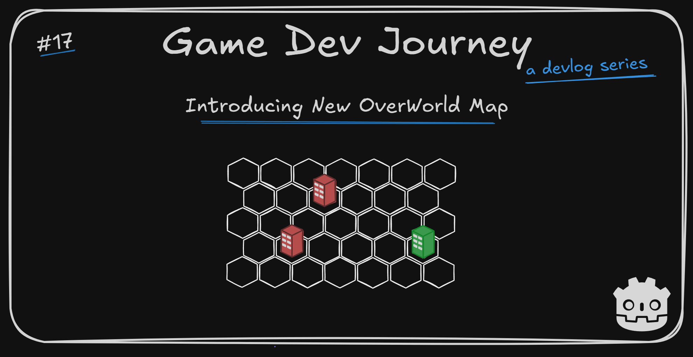

# Introducing New OverWorld Map

Greetings, fellow traveler. Intrigued about this project's next step ? Wondering how the player will switch between different Cities ?

Here's the answer! In this week's blog post, I introduce the project's next element - the overworld map - and briefly write about other experiments.

## This week's highlights

Since last update, I have completed the first (and hopefully not the last) "long format" blog post I've mentioned before. The topic ? Implementing the Tutorial System I have been writing about for the last few weeks.

> Remind me again. Why the separate post ?

In short, to keep these weekly posts "short" and focused on small updates, while keeping the more "guide-like" (tutorial-like ?) ones more detailed and be able to "stand alone" in the wild - so a reader looking for that info does not have to read all my other posts.

I also used it as an opportunity to try out "Github Gists" and their embed feature to share code snippets. Hope it improves the post's readability!

> Good thinking!

Apart from that, I have (slowly) started looking into implementing a "OverWorld Map", which will allow the player to select one City (level) to conquer or revisit. 

Still in early stages, but it already allows me to click on a "icon" placed in a static map and enter a specific City configuration. 

> So it will be like a "Slay the Spire" map ?

Not really. **Slay the Spire** generates a selection of events and connects them, letting the player which path to take. For my game, I want to allow the player to choose "any" level (within reason) as well as go back to previous Cities to manage them. I also want to allow the player to manage the collected Triggers and Actions (the same way you can "look" at cards in **Slay the Spire**), spend Resources to craft or unlock new stuff, and a few other things.  

Most of these *will not* be in the first version. I want to focus on having a working, navigable, overworld map first. Then I will increment all these features one-by-one.

> Wait, go back one sec. Crafting ? Unlocks ? What will we be crafting and unlocking ?

Once *we* get there, I will talk about that. Those ideas may even change or evolve until then.

## Plans for next week

The main goal for the next week will be having one **static** overworld map with three distinct City levels, all of them also static. This will act as the foundation for the tutorial / demo / showcase of the game that I want to reach. 

If possible, also prepare it for a standard run, where each level' base information is generated on start and wire everything together. Upon selecting a level for the first time, it's layout is generated in runtime and saved. When returning to a level, it should load up the same layout. So, mostly data-related stuff.

And after that... I will think on something. More precisely, choose what that something is!

Hope this blog post was helpful in any way.  
Got a question or just wanna discuss something? Feel free to reach out!  
And thank you for reading!