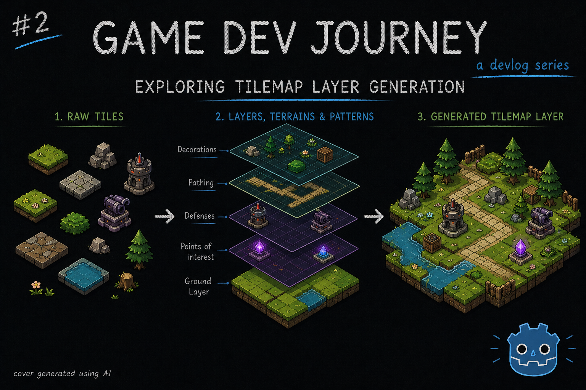
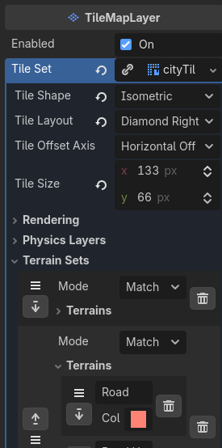
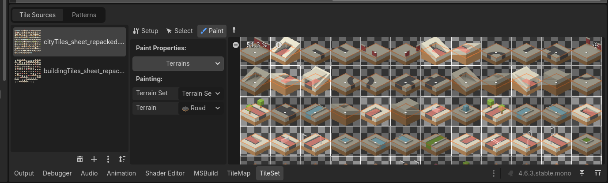
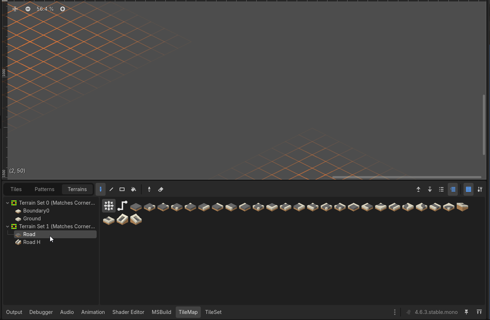

# Exploring TileMapLayer Generation

Greetings, fellow traveler. Curious what you can achieve with TileMapLayer in Godot ? 



Then stay and read a bit! This week I decided to follow up on last week's work with 2D isometric assets and see what kind of options Godot offers up.

> Wait a minute! I was promised a magic tool to import sprites! Where is it ?

Not how I remember it. Pretty sure I said *if* anyone reaches out interested in it, I would publish it. And noone did. Besides you, figure of my imagination I use to articulate my explanations.
But, let's make it easier. If anyone reaches out *or* I get 10 likes on this post's tweet *or* this article gets read by 10 people, I release it.

Now, back to this week's update. After succesfully importing my 2D isometric assets unto Godot and was able to create a sample city, I decided to delve deeper and see what more I could get out of them.

After much reading and pondering, I decided to create an algorithm to procedurally generate a city layout, which ... is not finished. Yet. That isn't to say I haven't learned anything so far. I learned about TileMapLayer's **Terrain Sets**, **Terrains** and **Patterns** and also tested out a way of saving and loading a given layer's configuration from a json file

> Fancy keywords, but what are they exactly ?

I'll get into them shortly. Let me just break this post into two sections

## TileMapLayer's Terrains and Patterns

Placing each tile into it's perfect position might sound like a good idea for a bit, but it gets tedious *super* fast. So we need ways of improving this, usually through some sort of "rule" or "preset" of sorts. Luckily, Godot has both!

With **Terrain Sets** and **Terrains**, you can create simple rules to tell the Godot Engine to "group up" similar tiles together, and how exactly they go together. We can find a lot of examples of this online, mostly applied to 2d platformers and such where we create "ground tiles" and "platform" tiles. So, how can this help us in a Isometric view map ? 

> Yeah, how does this help ? Oops, carry on.

Well ... We can also take advantage of the "common" examples, such as the "ground tile" example. It's just a different point of view. I used it this week to build a "road" system.

I started by creating a **Terrain Set** (a group of terrains) and a "road" **Terrain**, like this :



Then, on the TileSet panel, I went to the `Paint` section, selected the Terrains property (picking the one I just created) and started clicking on the tiles that I wanted to mark as "road", coloring the sides and cornes that made sense based on each tile, like so :



How to know which side to color in ? Super simple : Just need to "paint" the sides or cornes that we want connected with other tiles of the same kind. So, in this example, I just had to color in the actual road bits!

And how does it look, in practice ? Something along the lines of this :



> Oh, oh! That looked great! Think of the possibilities 

Yeah, think of the possibilities! No, seriously, think of the possibilities. I need more ideas :)

> Ah ha! Fair enough. What about the Pattern thing ?

Oh, also very simple to explain.

Imagine you place a small set of tiles close together that you would like to save and reuse. Maybe ... A nice city garden with a fountain.

With that, just head over to the TileMap panel, on the Patterns section and start selecting the tiles you like.

> Uh huh. And then ?

Then, just drag that into the Patterns section, and its saved! Now, you can use it with the "Paint tool" as if it was a tile, but bigger

> That's it ? I like it!

Yup. Super easy. I'm planning on using this to create small "city building blocks" to then be used by an algorithm to generate endless city variations! Still in the making, but it's the plan so far!

## Saving and Loading a TileMapLayer

Whether I have either carefully crafted or procedurally generated city layouts, I will always have the need of storing this information somewhere, so it can be retrieved and shown later. Yeah, I could have each be it's own `Scene` in Godo, but it quickly transforms into a mess, with repeated code and needlessly complex loading logic. I also want to be able to quickly read and change stuff across multiple different cities, in case I have to (example : replace all corner tiles with a prettier version to highlight something).

With this and other reasons in mind, I decided to create some quick functions to allow me to do just that - have a simple, textual representation (json, in my case) and a couple of methods to help me load from and save to file.

I won't go into *too much* detail, but here's the gist of what I did:
* Decided to save the information about each tile I am using from the TileSet
* Since I'm working with a square map, I am storing this info in a 2 dimension matrix
* I also threw in the name of the texture, in case I end up having multiple applicable (different biomes in the future ? who knows)
* Created one method that loads this info from file and another that saves to file
* On my City layout scene, I wrote methods that know how to load this simple info into a TileMapLayer, separating the `data` from its visual representation

Here's the relevant code snippets for the save and load functions, in case you need ideas :

```gdscript
func load_city_layout(city_name: String) -> CityLayout:
	var city_layout_res = "res://Data/%s.json" % city_name

	if not FileAccess.file_exists(city_layout_res):
		push_error("Failed to find city layout file: %s" % city_layout_res)
		return null

	var fileContent = FileAccess.get_file_as_string(city_layout_res)

	var city_layout_data = JSON.parse_string(fileContent) as Variant
	var city_layout = CityLayout.new(city_layout_data)

	return city_layout
```

```gdscript
func save_city_layout(city_name: String, tile_map: TileMapLayer) -> CityLayout:
	var city_layout_res = "res://Data/%s.json" % city_name

	var city_layout_data = {
		"texture": tile_map.tile_set.resource_path.get_file().get_basename(),
		"ground": []
	}

	var used_area = tile_map.get_used_rect()

	for x in range(used_area.position.x, used_area.end.x):
		var column = []
		for y in range(used_area.position.y, used_area.end.y):
			var position = Vector2i(x, y)

			var id = tile_map.get_cell_source_id(position)
			
			var atlas_coords = tile_map.get_cell_atlas_coords(position)
			var atlas_alt = tile_map.get_cell_alternative_tile(position)
			column.append({
				"id": id,
				"ax": atlas_coords.x,
				"ay": atlas_coords.y,
				"alt": atlas_alt
			})
		city_layout_data["ground"].append(column)

	var jsonString = JSON.stringify(city_layout_data, "\t")
	
	var save_file = FileAccess.open(city_layout_res, FileAccess.WRITE)

	save_file.store_string(jsonString)
	save_file.close()

	return CityLayout.new(city_layout_data)
```

Loading into a TileMapLayer is nothing more than a cycle to go through each cell's (row and column) configuration and use the `set_cell` method, something like this :

```gdscript
var x := -1
var y := -1

for row in city_layout.ground:
    x += 1
    y = -1
    for tile in row:
        y += 1
        
        if tile.id == -1:
            continue
        
        var cell_position = Vector2i(x, y)
        var atlas_position = Vector2i(tile.ax, tile.ay)

        $GroundLayer.set_cell(cell_position, tile.id, atlas_position, tile.alt)
```

And ... I think that's all for this week's blog post.

Hope this blog post was helpful in any way.  
Got a question or just wanna discuss something? Feel free to reach out!  
And thank you for reading!