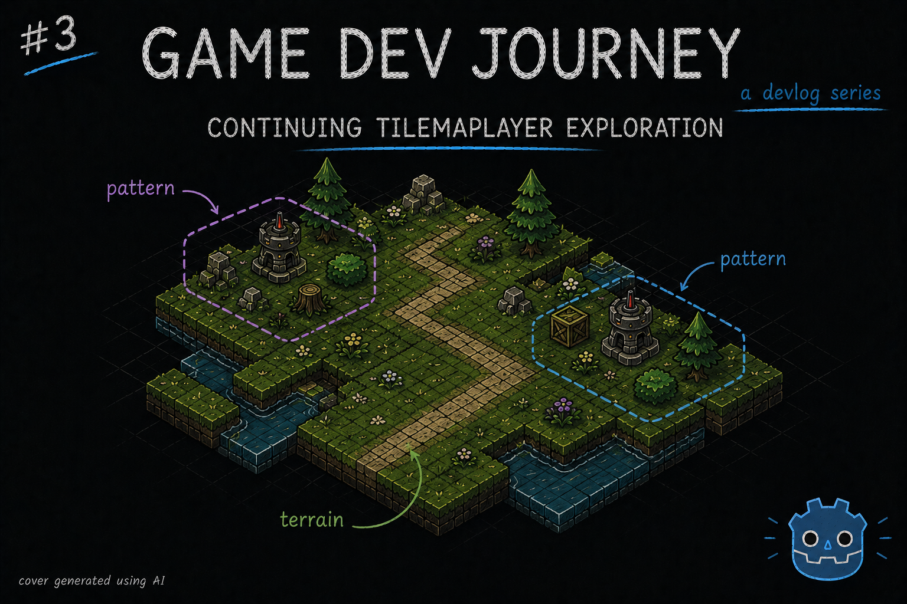
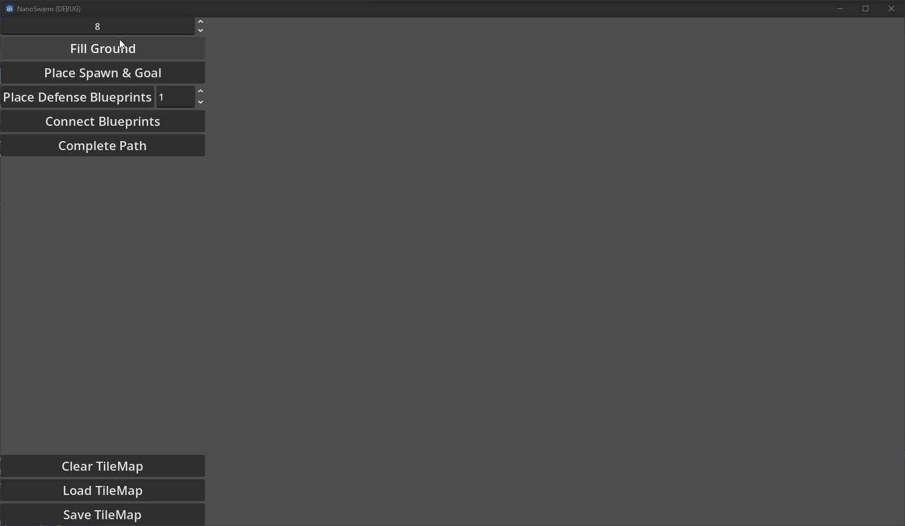

# Continuing TileMapLayer Exploration

Greetings, fellow traveler. Have you finished setting up your TileMapLayer's Terrains and Patterns ? Wondering how to use them in code ?



Wonder no more! In this week's blog post, I created the first version of my city layout generation, using both the Terrains and Patterns I talked about in my last post, as well as a playground scene that helps me test out all of this.

On last week's blog post, I wrote about how to create Terrains (simple rules to tell which tile connects with which) and Patterns (simple groups of tiles that can be reused in the editor) and how that could be useful to generate a given layout. So, the next logical step is to create some sort of algorithm to do just that.

> That sounds... hard. I don't have the brain power for it

Perhaps at first, yes. But, as with ever problem in programming, there's always the golden rule of "Splitting one problem into smaller ones". That always does it for me. In this instance, here's what I thought of: 
* Start with creating a square region with one "Ground" tile
* Try to add one Pattern on top of the square map
* Try to add more Patterns, without overlapping each other
* Create one "complete" road from start to finish. Again, without overlapping important tiles
* Add a UI component on top of all this, to simplify interacting with all this

A short list, for sure. But enough to test out a bit of everything. Retrieving data, placing one or more Tiles, checking if a Tile is of a given Terrain type, etc. And suffice to say, I didn't create my current version in one go. I kept iterating and improving (and fixing weird bugs -.-) over the week.

> Okay, feeling a little more confident. Where do we start ?

That's the spirit! I'll write a brief summary of each section I wrote. Any questions or ideas, feel free to leave a comment somewhere.

## The Manager Class

To organize all the "logic-heavy" methods related with creating/editing a given City layout, I started by creating a "CityManager" class. Since it will deal with "outside" data, I decided to have it as a Singleton in the project - or as Godot calls it, an Autoload Global Variable. 

> A what now ?

A class that we only want to have 1 single instance of. Ideal for these kinds of scenarios. Normally, we'd have to write a piece or two of code to ensure it would only have 1 instance at all times, maybe dwelve deeper and learn about *Dependency Injection* and *LifeTime Scopes* and other fancy terms. But, in here ? We get off easy and only need to click on a few buttons.

After creating your class file, go to `Project` > `Globals` > `Autoload`. You should be able to find your class file and add it as a "Global Variable". After that, we can reference it by name anywhere without having to think of instancing it (as if all methods were static methods in the class, for those who know)

> Hum... I'm getting an error about the name already existing ?

Oh, I also fell for that one. For some reason, this class of ours **can't** have the usual `class_name MyClassNameHere` line. It conflicts with the Global Variable name bit. Remove it and you should be fine (I commented it out, cause it makes sense in my head to be there. Go figure)

In this file, I'll create all the methods that deal with a City's TileMapLayer, as well as loading and saving the results.

## The City Scene

Since my goal is to have multiple, procedurally generated, Cities in my game, it would not make much sense to create one new scene for each. Instead, I decided to create the following structure:
* 1x **City Layout** Scene (Node2D) that holds the TileMapLayer (one, for now) with *no* TileSet. This component will receive its TileSet as an export variable from some other component and hold any logic especific to the layout (for example, loading a specific city configuration to the its TileMapLayer)
* 1x **TileGenHUD** Scene (Control) that contains a bunch of buttons and inputs (numeric, mostly) so that I can run the generation methods in any order I like, without having to edit code and restart debugging. This component is only concerned with handling the input events and propagating them upwards
* 1x **City** Scene (Node2D) that ties everything together. Will connect to the HUD's events and call the respective method in the **CityManager** class, then pass the results to the Layout.

This approach allows me focusing in one different concern (logic vs layout) at a time. If it's the best approach ? No clue. But it works for me.

## Terraforming Methods

Won't go into too much detail here (else this blog post would be long for no good reason). Instead, I'll highlight the Godot built in methods I found interesting and, perhaps more importantly, some pitfalls I fell in. (Besides. I'm already thinking of the next, much improved, version)

As usual, any questions are welcome. 

Most, if not all, of the methods I created ended up using one or both the TileMapLayer and the size I configured for the grid. So, starting with those seems and later remove what is not in use seems a good idea.

To place any kind of Tile we want, I used one of three methods from TileMapLayer:
- `set_cell` : Allows to place one specific Tile by specifying its position in the TileMap's Grid (a Vector2i), and the Tile's info (id, where it is in the TileSet, and if it is a "normal" tile or a "alternative" tile). We can get all this values either from the `TileSet` panel in the editor, or via code.
- `set_cells_terrain_connect` : Allows to place multiple tiles at once, as long as they are from the same Terrain. Just need to pass an array of positions and the Terrain's information (two IDs. we can grab those from the Editor, store them as constants somewhere in the code, and use them here). Great to fill entire sections
- `set_cells_terrain_path` : Allows to place multiple tiles at once, just like the previous one. This one is more intended for "paths", as the name suggestions. Uses the same exact input parameters too.

I tinkered with multiple versions to see what made sense, and ended up with:
- Using the `set_cells_terrain_connect` to fill the Ground with a Size by Size square. Two `for` loops to create all the cells' positions, appending them to an array, call the `set_cells_terrain_connect` with the Terrain info I wanted and done
- Surprising noone, I used `set_cells_terrain_path` to create roads to connect two or more points of interest by calculating before hand the path to take, tile by tile (in order), save it on an array, then call the method. Careful, the method is "finicky". Miss a tile in your path or place the same one twice by mistake, and it won't carve any path for you.
- Combined the `set_cell` with TileSet's `get_pattern` (which, for a given index, returns the Pattern info) and a few others to place any Pattern I wanted on my TileMapLayer

This last one might warrant an example. Here:

```
func place_pattern(layer: TileMapLayer, pattern, origin: Vector2i):
	for cell in pattern.get_used_cells():
		var pos = origin + cell

		var id = pattern.get_cell_source_id(cell)
		var atlas_position = pattern.get_cell_atlas_coords(cell)
		var alt = pattern.get_cell_alternative_tile(cell)

		layer.set_cell(pos, id, atlas_position, alt)

## example call
place_pattern(layer, layer.tile_set.get_pattern(1), Vector2i(5,5))
```

Depending on what you want to achieve, there's also a few other useful methods. I particularly liked TileMapLayer's `get_cell_tile_data`. For a given cell/position, it gives the Tile's info from its TileSet. I used it a lot to check if a given tile was a Ground Tile (a Tile that belongs to the Ground Terrain I created), or a Road Tile. Even created the following utility methods (double check the constant values if you use this yourself): 

```
# Terrain indices
const TERRAIN_SET_GROUND := 0
const TERRAIN_BOUNDARY := 0
const TERRAIN_GROUND := 1

const TERRAIN_SET_ROAD := 1
const TERRAIN_ROAD := 0

func _is_road_tile(tileData: TileData) -> bool:
	return tileData != null and tileData.terrain_set == TERRAIN_SET_ROAD and tileData.terrain == TERRAIN_ROAD

func _is_ground_tile(tileData: TileData) -> bool:
	return tileData != null and tileData.terrain_set == TERRAIN_SET_GROUND and tileData.terrain == TERRAIN_GROUND
```

And, probably the one I spent the most time on, one of my utility methods for the road logic.

> Oh, oh! Share it!

Ah ha. Sure.
For my "first version" of the road logic, I thought "Well, my Patterns already contain some road tiles. Those are taken care of. So, I probably should start with something that tries to connect those together!"

> Makes total sense

Thought so too. Now, to do that, I came up with the idea of using the Terrain peering info (those little squares we paint to tell where a given Tile "connects" with others) to see which way a given Road Tile goes. Then, try and go that way (as in, move 1 Tile over) and check if that Tile is a Road Tile. If not, make it so.

> Genius! Marvelous!

Hey, one of those two sounded like sarcasm to me!

Anyway, here's the relevant bit : 

```
func _check_incomplete_road_tile(layer: TileMapLayer, tileData: TileData, cell: Vector2i, neighbor: TileSet.CellNeighbor, direction: Vector2i) -> Variant:
	if tileData == null:
		return null

	if !_is_road_tile(tileData):
		return null
	
	# if tileData.is_valid_terrain_peering_bit(neighbor): # Don't use this one
	if tileData.get_terrain_peering_bit(neighbor) == 0:
		var next_pos = cell + direction
		var nextTileData = layer.get_cell_tile_data(next_pos)

		var isGround = _is_ground_tile(nextTileData)

		if isGround:
			return {
				"position": cell,
				"direction": direction
			}
	
	return null

## example use : check which Road tiles in the TileMapLayer need to be completed

const DIRS = {
	"up": Vector2i(1, 0),
	"down": Vector2i(-1, 0),
	"left": Vector2i(0, -1),
	"right": Vector2i(0, 1)
}

var staging_road_segments = []

for cell in layer.get_used_cells():
    
    var cellTileData = layer.get_cell_tile_data(cell)

    var rightNeighbor = _check_incomplete_road_tile(layer, cellTileData, cell, TileSet.CellNeighbor.CELL_NEIGHBOR_BOTTOM_RIGHT_SIDE, DIRS["right"])
    if rightNeighbor != null:
        staging_road_segments.append(rightNeighbor)
    
    var downNeighbor = _check_incomplete_road_tile(layer, cellTileData, cell, TileSet.CellNeighbor.CELL_NEIGHBOR_BOTTOM_LEFT_SIDE, DIRS["down"])
    if downNeighbor != null:
        staging_road_segments.append(downNeighbor)
    
    var leftNeighbor = _check_incomplete_road_tile(layer, cellTileData, cell, TileSet.CellNeighbor.CELL_NEIGHBOR_TOP_LEFT_SIDE, DIRS["left"])
    if leftNeighbor != null:
        staging_road_segments.append(leftNeighbor)
    
    var upNeighbor = _check_incomplete_road_tile(layer, cellTileData, cell, TileSet.CellNeighbor.CELL_NEIGHBOR_TOP_RIGHT_SIDE, DIRS["up"])
    if upNeighbor != null:
        staging_road_segments.append(upNeighbor)
```

This example right here checks all Road Tiles for the 4 common directions. If its neighbour Tile is not a Road Tile, it adds it to the array for further processing

> Very neat! Any other tips for me? 

I already shared quite a bit this week. But fine... One more.

For my use case, I decided to have the City Layout "centered" in the screen. And in the early stages, I solved that by "shifting" every Tile I placed by a given constant (example: adding up a Vector2i(10, 10) to every position I calculated).

This works, until it doesn't. And to fix it, it takes too much effort. Good thing I found a better and simpler solution.

On my City Scene, I moved my CityLayout instance inside a Container (Control node). And moved that container's anchor to the place I wanted the city layout to start/spawn from. There, no more calculations needed

And that's it! No more tips for this week.

Before finishing this post, here's a small demo of all of this working out



Hope this blog post was helpful in any way.  
Got a question or just wanna discuss something? Feel free to reach out!  
And thank you for reading!