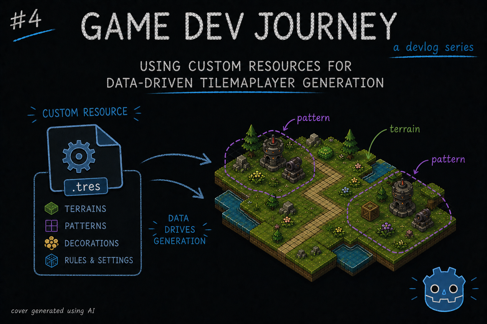
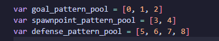
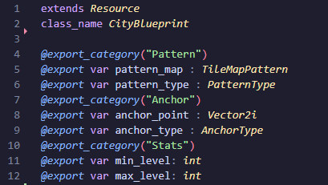
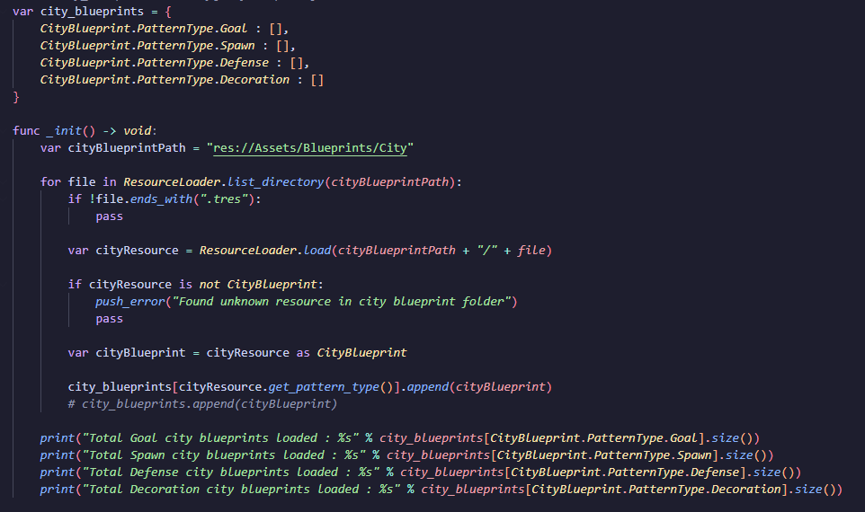

# Using Custom Resources for Data-Driven TileMapLayer Generation

Greetings, fellow traveler. Ever thought how you could do *more* with your TileSets ? Grew tired of placing your hand-crafted Patterns randomly ?



Then this blog post might be for you! In this week's blog post I write about Godot's `Custom Resources` and how I started shaping my city layout generation to be more **data** driven, and less random.

Keeping with the theme of the last few blog posts, I keep improving on my layout generation algorithm until I have a version I'm comfortable with (not a "final" version, as I fully believe I will be tweaking this every now and then)

> Then how do you know when it's "good enough" ?

Probably when I am able to press one button, look at the result and go "hey, not half bad!". Which might be *checks calendar* someday!

However, for this post I want to focus less on the algorithm itself, and more on the `Custom Resource` I created that enables me all the improvements I want. And what is this, you ask ?

In the same way that Godot stores some of its info in `Resources` (images, audio files, 3d models, etc), we can expand on this system and create our own types of Resources.

> Not following. What is a Resource to begin with ?

Fair question. The full explanation is in the [official docs](https://docs.godotengine.org/en/stable/tutorials/scripting/resources.html) but, to keep it simple, its a special kind of class, intended for saving and storing **data** and less for doing the pretty things (example : a scene with all our buttons). Among all the advantages, the two I'd like to highlight are:
- Godot handles all serialization-related work for us (via `ResourceSaver` and `ResourceLoader`)
- We can quickly edit the data via Godot's `Inspector` panel

> Ooh. So instead of me handling json read/write, I can use this right out of the gate ? 

Yup. And as much as I like using json to store data, I won't say no to a built-in "proper" way of doing this! So, with all that in mind, how do we get started with custom Resources ?

Creating a custom Resource class is very much like creating a custom class or adding a script to one of our Node2D's elements. Here's the gist:
- We create a new file, ither manually in the file explorer, or via the Godot's editor and picking the `Resource` option. Just ensure it has `extends Resource`
- We give it a suitable class name. Example : `class_name MyCustomResource`
- We start adding the properties we need, with the `@export` tag, so they are marked for serialization
- We end up a custom constructor with one input parameter for each property and it's default value. 

Something like this: 

```
extends Resource
class_name MyCustomResource

@export var name: String
@export var hp: int

func _init(resource_name: String, resource_hp: int) -> void:
    name = resource_name
    hp = resource_hp
```

Simple, yet effective. With this, we have a great way of storing data related to enemy stats, player stats, items, and anything in between!

> Looks simple, yeah. But, I'm not sure how to connect this to the whole layout generation stuff

Aah. That is a combination of a few ideas and tricks that I thought of while trying to answer this question : "How can I add custom metadata to the Patters I created in my TileSet?"

Don't get me wrong, the TileSet's Pattern feature is great and all (I wrote about it on my last dev blog), but I wanted a bit more out of it. For example, I want to be able to "group" my Patterns depending on their intended usage. Is it a spawn location ? A turret heavy location ? Or just plan decorations ?

At runtime, I don't know with only what the Pattern gives me (the the Tile Data and its positions). In theory, I *could* associate a custom data layer to each tile (and I did) to each tile, and then cycle through each Tile in the Pattern looking for this info, but that doesn't seem like a good idea in the long run.



On the previous iteration of my layout algorithm, to dodge this issue I did this quick-and-dirty solution of creating one array per group that I wanted, and manually adding the index of each Pattern to their respective array. Which "works", yes, but it's not good. And the problem gets worse as soon as we start talking about being able to pick a specific Pattern by "level", by "zone" or any other type of info specific to the Pattern, not the sum of its Tiles.

With all that in mind, here is where the `Custom Resources` come in to solve this issue. I can create a resource that holds in one property the `TileMapPattern` data (not the whole `TileSet` nor `TileMapLayer`. Just the Pattern itself) plus any other properties that I want.

In practice, looks something like this:



*I even threw in some extra `@export_category` tags to group the fields in the `Inspector` panel. Makes it look professional*

With this, I can create as many Resource files as I want (1 per "Blueprint") and load them dynamically with a quick method in my helper class:



Now, it's all a matter of adjusting my existing code to retrieve the pattern information from *this* collection of blueprints, instead of directly going to the `TileSet.get_pattern(index)`. And I can adjust my blueprint-picking logic to be anything that I want, as long as I have the data for it!

> Woah, just like that ? And how do you save your Resources ? Can you 'export' the Pattern info somehow ?

That... Is the tricky part of all this. After all my research, I didn't find any "one button push" solution in the Editor to copy/export the `TileMapPattern` data to a custom Resource file. It's pretty easy to do in code - just retrieve the Pattern you want, assign it on our Resource, use the `ResourceLoader` class - but... Doing it manually it's a chore.

Which is why...

> Oh, let me guess. Something something custom plugin?

Something something custom plugin that's being worked on, yes. Still with a lot of quirks, and only works with this Resource, but it's functional. 

> But what if I want to do my own Custom Resource? And have my own plugin?

If you like this workflow I've created for myself, you're more than welcome to send a message *somewhere* and I can try to help. I can't write about *everything* else I'd spend all my free time doing just that.

> ...Fine! I guess that's fair.

Good. And, think of it this way: it's a good opportunity to practice some specific GDScript code. May come in handy in future gamedev-related issues.

With that... I think this is all for this blog post. A slightly different one since I focused on one particular aspect, but seemed like a good topic.

Hope this blog post was helpful in any way.  
Got a question or just wanna discuss something? Feel free to reach out!  
And thank you for reading!

scaffold
- fill_ground > moved to only using one call to TileMapLayer
- one important comment about is_valid_terrain_peering_bit
- workspace > task to get current weeks log (useful as scaffold for blog post)
- Merge pull request #20 from ArchCodex29/asset-import-test
- started defining custom CityBlueprint resource to expand on the City Tile Patterns
- [experimental] addon to export TileSet's TileMapPattern into CityBlueprint resource
- existing tileset patterns moved to custom resource; new place blueprint func (in testing)
- CityBlueprint resource variable clarification; methods to place spawn and goal improved
- progress on place_defenses logic. using the blueprint logic + first version of picking blueprint based of context data
- small scene adjusts
- handle_road_segments > improved getting intersection point to support points already in line
- place_defenses > support for call with no goal or spawn info