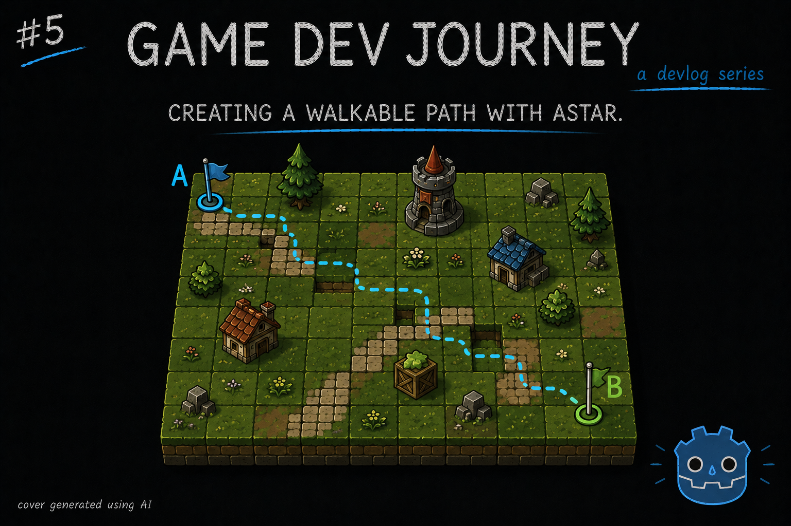

# Creating a Walkable Path with AStar

Greetings, fellow traveler. So far, we've placed a few blueprints in our city layout, some with road sections and some without. Wouldn't it be neat if we had one full road from the spawn point to the goal ?



Yes it would! And that is this week's dev blog theme! I improve my city layout generation by creating a step that completes the road path from point A to point B, using Godot's AStarGrid2D as a base plus my existing TileSet's custom data.

On my last two blog post, I talked about how I am generating the base layout of a city level in my game by hand-crafting small, reusable, city "blueprints" that I then place unto an isometric grid, using data to guide where a given blueprint may be placed. This allows me to design specific assets to achieve a given look or gameplay aspect and combine it with RNG to procedurally generate a lot more levels that what I could do, in the same time, by hand.

But still, having these blueprints and rules don't guarantee that I end up with one fundamental thing : A complete (road) path that goes from point A (the swarm's spawn point) to point B (the city's core). Which, if you ever played a tower defense game, its a must.

And so, what is the classic way of solving this kind of challenge ? A pathfinding algorithm, like **AStar**.

> A star what now ?

Let me give a super quick explanation. A pathfinding algorithm is a set of rules that allows someone or something calculate (or "find") what is the optimal path to take from one place to another. Think "GPS", and how it quickly draws a path from your current location to the nearby restaurant. There are various ways of achieving this, each with its pros and cons. One of the most common algorithms (and one that is already implemented in Godot) is [AStar Algorithm](https://en.wikipedia.org/wiki/A*_search_algorithm).

If you are interested, there's a lot you can read up about how these kinds of algorithms work and its use cases.

I'll focus on achieving my goal and use one of Godot's included implementations as a basis, the [AStarGrid2D](https://docs.godotengine.org/en/stable/classes/class_astargrid2d.html).

With this usefull class, we can define a 2D grid (hence the name) with cells that may or may not be "walkable". By default, all cells are walkable unless we say otherwise. Then, if we want to find a path between `pointA` and `pointB` (two 2D Vector points), we can use the `get_id_path(pointA, pointb)` method and we receive an ordered array with all the points that form the path.

> I think I get it. But why are we using this AStarGrid2D, and not the original AStar2D ?

Good catch! Since I am working on a static, flat square grid, this one seemed easier to integrate with for my use case. But the base AStar2D would be able to do the same too.

> Cool! Seems easy enough! But, why did we need this again?

To *complete* the city layout. Or, in other words, to ensure that when you look at the city, there is one pretty road that goes from one side to the other.

> So we use these points to do some stuff in the TileMapLayer, right?

Yup. That's pretty much the gist of it. My first thought was "If I can map what I have on my `TileMapLayer` to the `AStarGrid2D` and find a valid path, then all I have to do is map it back!"

I will include below the relevant snippets that I used to achieve this - the method that, for the received `TileMapLayer`, tries to set the needed road tiles and a custom class that inherits from `AStarGrid2D` to allow me to do further improvements on the pathfinding aspect without having to think on the other parts of the project.

```
func fill_road_astar_grid(layer: TileMapLayer, size: int, goal_position: Vector2i, spawn_position: Vector2i):
	 _start_point : Vector2i = spawn_position
	var _end_point : Vector2i = goal_position

	var _astar := RoadAStarGrid2D.new()
	
	_astar.setup_from_tilemap(layer)
	
	var _path = _astar.get_id_path(_start_point, _end_point)
		
	for cell in _path:
		var tileData = layer.get_cell_tile_data(cell)

		if tileData == null:
			continue

		if _is_ground_tile(tileData):
			layer.set_cells_terrain_connect(
				[cell],
				TERRAIN_SET_ROAD,
				TERRAIN_ROAD,
				false
			)
```

And now the class:

```
extends AStarGrid2D
class_name RoadAStarGrid2D

func _init():
	diagonal_mode = DIAGONAL_MODE_NEVER
	default_compute_heuristic = HEURISTIC_MANHATTAN
	default_estimate_heuristic = HEURISTIC_MANHATTAN

func setup_from_tilemap(tile_map_layer: TileMapLayer) -> void:
	used_rect: Rect2i = tile_map_layer.get_used_rect()
	var tile_size: Vector2i = tile_map_layer.tile_set.tile_size

	region = used_rect
	cell_size = Vector2(tile_size)

	update()

	for cell in tile_map_layer.get_used_cells():
		var tileData = tile_map_layer.get_cell_tile_data(cell)

		var weight : int = -1

		if CityManager._is_road_tile(tileData):
			weight = 1
		elif CityManager._is_ground_tile(tileData):
			weight = 10

		if weight == -1:
			set_point_solid(cell, true) # not walkable
		else:
			set_point_weight_scale(cell, weight) # lower weight = better
```

With this, I now have a way of ensuring my city layout is both pretty and also functional! I made sure to make it so only existing "ground" and "road" tiles were considered as "walkable" tiles, so the algorithm would not try and go over existing buildings and such.

Using this as a base, I can now improve and fine-tune this further to make it so the roads not only "connect", but also look "believable". For example, I can:
- Adjust the weights to improve the "decision making" of the algorithm
- Add logic to make the algorithm prefer to "connect" with existing "loose road ends" from blueprints
- Increase the weight when it tries to make a turn (not by much), to try and avoid zig-zag-looking roads
- And many more small adjustments!

Hope this blog post was helpful in any way.  
Got a question or just wanna discuss something? Feel free to reach out!  
And thank you for reading!