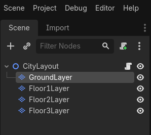

# Adding new Heights to my Tile Map Layers

Greetings, fellow traveler. Working with 2D assets on a 2D plane, but want to do more ? Maybe by adding a 3rd dimension (height) to the mix ? 


I thought so too! This week I decided to add a little more "detail" to my city map generation by introducing "height", in the form of different "buildings" that I pick to place on specific "foundation" tiles in my base "ground" layer.

Up until now, I have been focusing on improving how I generate the base layout of my city map by introducing concepts like "blueprints" (of which I pick a few of different types and place accordingly) and "pathing" (where I try to make sure there is one full road from point A to point B). But all those were focused on *one* TileMapLayer, so one "height, which makes sense since it's a 2D-related node using 2D assets. I want (need ?) to add more to each map!

With all that in mind, I decided to try adding height by completing the "building" portion of the city that, up until now, has been only one tile-height. To do that, I researched and tried out a few approaches until finding a simple, yet effective one.

> So, what is it ? Some special setting on the TileMapLayer ? Maybe a different type of node and we have to reconfigure stuff ? 

Not quite. Even more simple. Since we are using one TileMapLayer to represent essentially one "height" of our map, then for more heights we add *more* TileMapLayers!

> Really ? That's all there is to it ?

Also, not quite. That's the basic principle of it. While it is a simple way of getting started, it also required a bit of setup at first. It's also "limited" in the sense we need to "plan" how many heights we want to have in our map and create that many TileMapLayer nodes beforehand. (I guess we *could* add more dynamically via code, but I don't think I will need that much flexibility now). 

If you're curious, of all the links I stumbled upon [this](https://forum.godotengine.org/t/how-do-i-correctly-stack-isometric-tilemaplayers/113870/3) was the one that gave me the info I needed.

Let's not forget we also need a way to *add* tiles to the specific layers based on some rule or data. 

> More Layers, more settings, more code, what else ?

I'll write a small checklist, don't worry. Even I need it at this point:
- Add more TileMapLayer nodes to my city layout scene
- Setup each new layer to get the intended height effect
- Store the "Building Blueprints" in a Resource, then pick one randomly to be placed
- Pick a way to choose in which coordinates to place the new tiles on

For starters, to add the new layers I went to my reusable City Layout scene and added 3 new TileMapLayers and made sure my root node is a Node2D (was a Node before) and turned on the `Ordering` > `Y Sort Enabled` on all nodes.



Then, to make sure the layers stack "vertically" just the way we want, we need to both shift the Y origin upwards and downwards.

> I'm sorry, what ? 

My head also got stuck on that one for a bit. As far as I understood it, if we :
- turn on the `Y Sort Enabled` (mentioned earlier), so that layers with a bigger Y origin render on top of the other ones (by default, they are ordered the same way they show visually below the parent node)
- Shift up the `Rendering` > `Y Sort Origin` by the "height" (in pixels) we want for the layer (based on our TileSet's Size Y)
- Then shift down the `Transform` > `Position` > `Y` field by the same amount, but negative (so .. 16 >> -16), it shifts the grid "back" so it still lines up with our base layer. This lets us use the same 2D coordinate (ex: (4,4)) and then only change which layer we are referencing to go up or down.

To make sure I never have to think of this again (hopefully), I expanded an existing method I had that was assigning a given TileSet to my GroundLayer's TileMapLayer. It looks something like this (keep in mind, I adapted this to my isometric tileset): 

```
func set_tile_set(tile_set: TileSet) -> void:
	tileSetResource = tile_set
	$GroundLayer.tile_set = tileSetResource
	$Floor1Layer.tile_set = tileSetResource
	$Floor2Layer.tile_set = tileSetResource
	$Floor3Layer.tile_set = tileSetResource

	var tileSetY : int = tileSetResource.tile_size.y
	var layerOriginYStep : int = ceil(tileSetY / 2.0)

	var layerCurrentOriginYStep = layerOriginYStep

	layerCurrentOriginYStep += layerOriginYStep
	$Floor1Layer.y_sort_origin = layerCurrentOriginYStep
	$Floor1Layer.position.y = layerCurrentOriginYStep * -1
	
	layerCurrentOriginYStep += layerOriginYStep
	$Floor2Layer.y_sort_origin = layerCurrentOriginYStep
	$Floor2Layer.position.y = layerCurrentOriginYStep * -1
	
	layerCurrentOriginYStep += layerOriginYStep
	$Floor3Layer.y_sort_origin = layerCurrentOriginYStep
	$Floor3Layer.position.y = layerCurrentOriginYStep * -1
```

Not only it sets the TileSet to all the layers in one go, it also does all that height calculations and assignment in one go. With this, we can use our existing TileSet to place any tile we want on any given Layer.

With the Layers sorted, I now need something to be placed and, as I mentioned before, my goal is to place "buildings" on top of existing "foundations" so that they are "completed".

For this, I created a new resource named "BuildingBlueprint" that, similarly to my CityBlueprint, it holds a TileMapPattern. The trick ? Since I only want to deal with "height" on my buildings (which means, for now they all will be a 1 by 1 in 2D), I place the tiles in order on my "sandbox" TileMapLayer (as if it was a "deconstructed" building) then save that as a Pattern. Then, when I am placing them, I still iterate them as usual *but* I keep reusing the same base coordinates, changing only the layer I am setting a tile on.

> That's ... actually kinda smart. But what if you want to save 2 by 2 Buildings ?

I ... will think of that when I need it :) 

For now, It will do. And since the logic will be isolated in it's own Resource (plus the method that reads the info and places the tiles), which means it should be fairly easy to refactor in the future if need be. If you need a refresher on Godot's Custom Resources, I wrote about it on Devlog 4.

Now, all that's left its to actually place the tiles! And, as usual, it is a simple method too.

On my TileSet, I created a `Custom Data Layer` (which allows us to place "any" info we want on any tile) named "Placement_Type". Then, in the Tiles that may be used for "building foundations" (so, the floor 0 of a building), I set it to "Building". This info can be obtained by using a layer's `get_cell_tile_data` method and then `get_custom_data`.

Then, I quickly changed my CityBlueprint placement method to detect if a given tile has this "Building" value. If so, then I randomly pick a building and place it on the respective "floor" layers (which I have conveniently got in a ordered array).

The method itself looks something like this :

```
func place_building_on_foundation(floor_layers: Array[TileMapLayer], origin: Vector2i):
	if floor_layers.size() == 0: return

	var height : int = randi() % 3 + 1

	var blueprint = pick_building_blueprint(BuildingBlueprint.PatternType.House, height)
	var pattern = blueprint.get_tile_pattern()
	var used_cells = pattern.get_used_cells()

	for i in blueprint.height:
		var floor_layer = floor_layers.get(i)

		if floor == null: return

		var cell = used_cells[i]
		
		var id = pattern.get_cell_source_id(cell)
		var atlas_coords = pattern.get_cell_atlas_coords(cell)
		var alt = pattern.get_cell_alternative_tile(cell)

		floor_layer.set_cell(origin, id, atlas_coords, alt)
```

This should place the tiles in the TileMapPattern in the order we want, same X and Y positions and just change our "Z" position (height).

And that's the gist of it! While it is a simple approach, I can expand it later on for more interesting applications like:
- Having different "ground heights" / terrain elevation
- Expand on the Resource and Custom Data Layer to pick "better" placements
- And much more!

Hope this blog post was helpful in any way.  
Got a question or just wanna discuss something? Feel free to reach out!  
And thank you for reading!