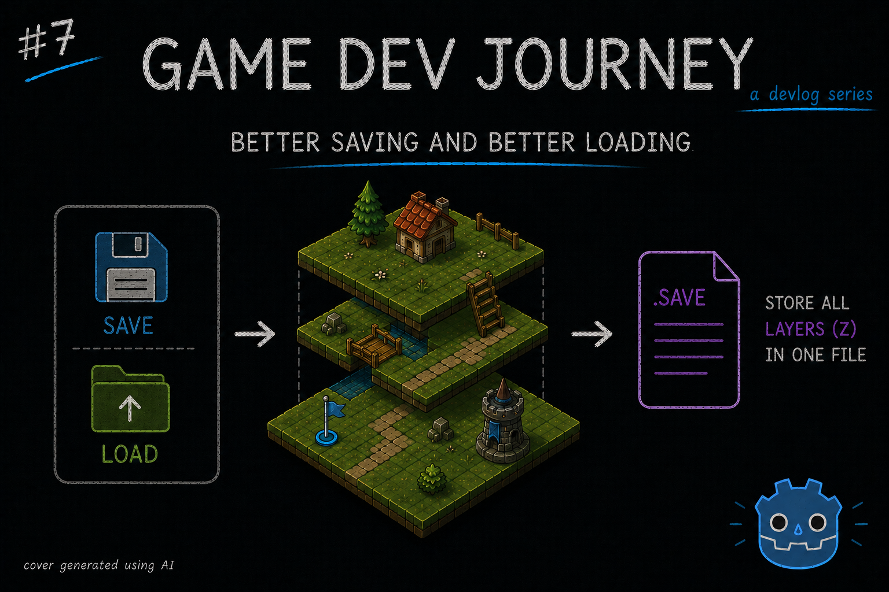
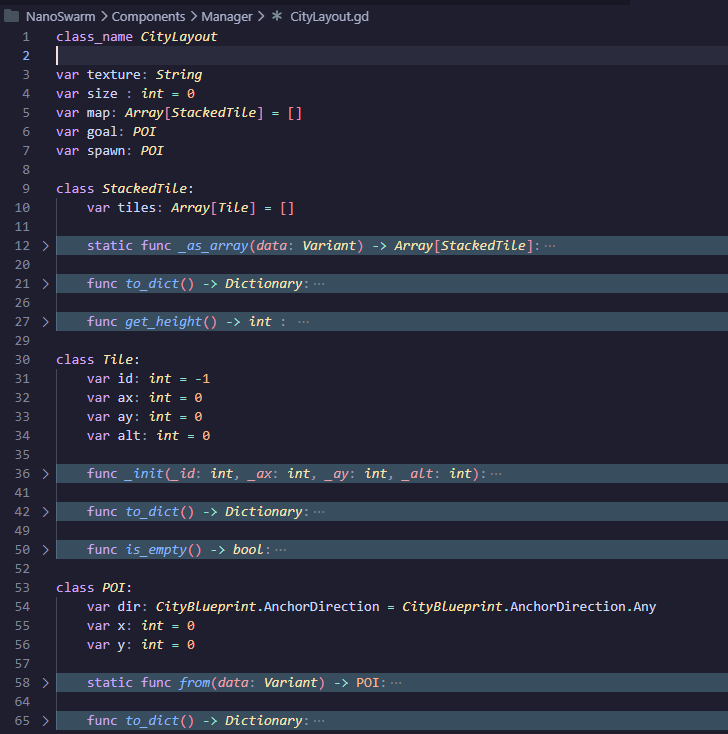
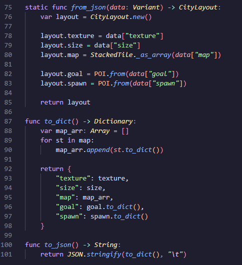

# Better saving and better loading

Greetings, fellow traveler. Curious how one can save to file multi-height TileMapLayers ? Maybe you're just wondering what I'm up to this week ?

Then welcome! This week I took the time to tackle some loose ends I left behind recently, in particular how to pack the info used to render multiple TileMapLayers into a single file to then be used in the game. 

I was also able to do other small improvements, such as creating a "Menu" to navigate between the all the prototype Scenes I got and improving a custom Godot Addon I got to be able to save and load the different custom Resource files I am using.

> Save and load tiles, save and load resources... I sense a theme here

That's normal, since I like to do thematic things! I'll focus this blog post on the saving and loading the TileMapLayers, but decided to mention the other improvements as well. As usual, if you're curious about anything that I don't go into detail, let me know!

If you've read my last blog post, you know I have improved my city layout generation to support multiple heights while still using 2D's TileMapLayer by using multiple of them, which allow to implement stuff like different height buildings!

Now, all the tiles used were placed *live* and we want to be able to revisit a given layout multiple times in the future. Earlier in this project I implemented a version that was able to save and load the info of a *single* TileMapLayer. So, it was time for me to expand on it.

> But shouldn't it be *just* save more instances of the same thing ?

I mean, you're not wrong. I could have done that, but the final JSON file would end up a bit too "verbose" for my taste. And, to be fair, I kinda wanted to see what I could do if I dedicated an hour or two to it.

So, what I wanted to achieve exactly ?
- I wanted to save important "points of interest" in the map. So far, those are the "Goal" and "Spawn" points
- I wanted to save the name of the TileSet the map is using. I already did this, so let's skip it
- I wanted to have as simple of a property as possible for the "map" itself. Must contain all the Tile info from all heights, but be easy to iterate over
- It should be easy to edit the file, at least while I'm developing. So I chose JSON as the format

After testing out a few ideas, here's the top level of what I came up with.

For the "points of interest", I created a simple class that is able to represent both the "Goal" and "Spawn" points with simple properties. For the "Map" itself, I have created the following :
- The map is represented by an array of "StackedTiles" and is accompanied with a "size" property, which represents the length of the side of the map
- Each "StackedTile" represents one 2D point in the overall grid (ex: (3, 6)) and contains an array of "Tiles", one for each height filled in that position
- Each "Tile" has the Tile info needed to set the cell in a given TileMapLayer
- When I am loading the map, I can do two basic `for` cycles "size" times to get the grid effect. After every iteration I grab the "next" item in the array to place in the multiple TileMapLayers.
- Then, for each height, I grab both the corresponding tile in the "StackedTile" and the appropriate TileMapLayer and use the `set_cell` method

Not a bad way to save all the data, right ? 

As a bonus, I included a suite of utilitary methods to instanciate from a Variant and transform to a sample Dictionary to simplify the read/write JSON bit, since the native GDScript's methods for that seem to work best with those simple formats. Depending on the course of this project, If I end up needed the JSON capabilities for a lot of classes, I'll just default to write all I need in a C# lib. If not ? The GDScript methods work fine.

Here's an example of said utility methods that help me transform the data's format to better suit my needs. I'd like to point out that each small class has its own "version" that I combine here, which makes it easier to read (for me, at least).

> Huh, the file structure does seem easy to understand. Now I get it!

Neat! That's always one of the goals :)

And I think I'll end the post here. A short one, for sure. I am trying to keep the "routine" alive and writing shorter (and frequent) blog posts help. I promise every now and then I will write longer form blog posts when a given topic is worthy of it.

Hope this blog post was helpful in any way.  
Got a question or just wanna discuss something? Feel free to reach out!  
And thank you for reading!