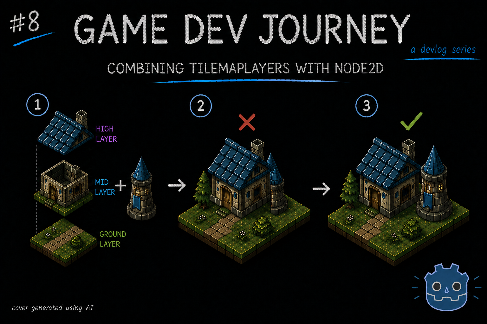
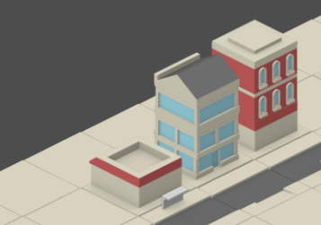
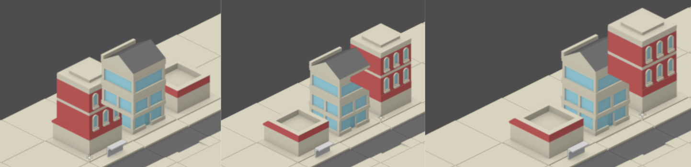

# Combining TileMapLayers with Node2D

Greetings, fellow traveler. Looking into adding some moving parts in your 2D tile maps ? Maybe you've already tried and got stuck with weird placement or clipping ?

Then this might help! In this week's blog post I write about adding custom Node2D scenes on top of an existing TileMapLayer, the issues that spun from it and how I was able to fix them, ending up with an almost seamless combination of TileMapLayers and Node2D instances!

Let's start with a quick question : In this image, can you tell which building is a custom Node2D with Sprite2Ds and which belongs to my TileMapLayers ?

> Hum, the middle one with all the windows ? 'Cause the bottom part is different.

Fair guess. But it's actually the red building on the right.

In that image, all "bottom"/ground sections are regular tiles. The Node2D-based builting is sitting on top of it. Neat trick, right ?

> It is! So, careful placement gives it this effect ?

Well, it needs careful placement but that's only part of it. To get the effect with the pieces I wanted to use, it actually took a good dosage of research and a bit of trial and error.

Here's a few examples, side by side, of the issues I got when I tried to do this :

It ranged from the Node instance being always on top (or bottom) of everything, not (Y) sorting properly when placed behind other tile-based things and, when that worked, it would *always* stay behind other tile-based things, even when it was clearly in front of it.

> That doesn't sound like fun.

No it was not. In fact, it was so troublesome for me - who's learning the Godot engine as I go - that I am making sure I write this somewhere, because if this issue happens again, I will loose my nerve. But enough of that.

On the next section I will write about the different ideas I tried and the issues associated with them. If you want, you can scroll down to see what I ended up with, but I do recommend reading through the whole thing. Even if some ideas did not work for *my* use case, that doesn't mean they are *bad* ideas. They could very well help you fixing your specific problem.

(...)

Quick mention : Since I now have *more* elements being created on the city, I naturally had to update the saving/loading-related methods to accomodate the new Turret info. I decided to create a new "CityData" class that contains two properties (for now) : the existing CityLayout and an array of "EnemyData" elements that contains the info I need about the Turrets I placed, with some tricks here and there to help me *not* touch this so soon in case I expand with more enemy types. If you're curious about this too, let me know.

And with that last bit, it's the end of this update!

Hope this blog post was helpful in any way.  
Got a question or just wanna discuss something? Feel free to reach out!  
And thank you for reading!

scaffold: 
- ~~new CityGen scene to isolate/move the test HUD logic out of the core City scene~~
- (sandbox) sample isometric turret with proper y sort with tilemaplayers
- further testing. looks like that, for taller turrets, it "needs" to be placed as child of the corresponding height
- configuring tileset's sample tiles with y sort; testing spawning turret instance via code
- changed approach for turret visual placement. position/spawn based (no longer need the per tile y sort)
- turret hitbox pos
- new "defenses" node in city scene for organization purposes
- configuring tileset's sample tiles with y sort; testing spawning turret instance via code
- changed approach for turret visual placement. position/spawn based (no longer need the per tile y sort)
- turret hitbox pos
- save/load methods improved. now saves "city data" which includes "layout" and "enemies"