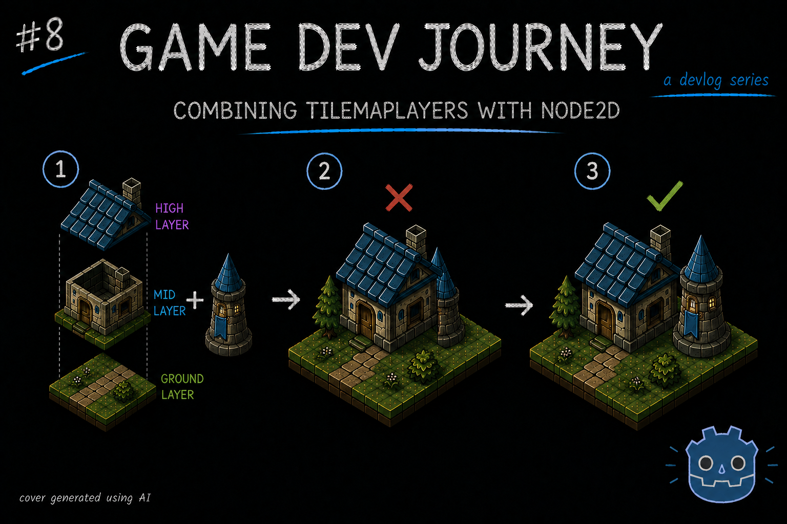
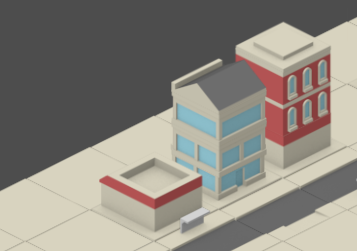
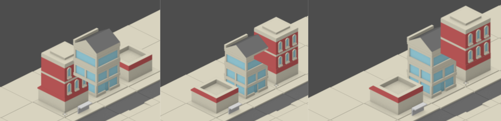
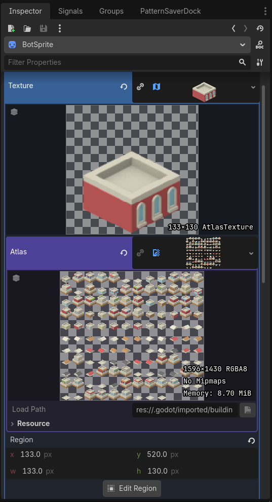
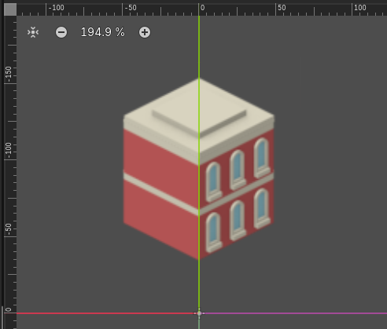
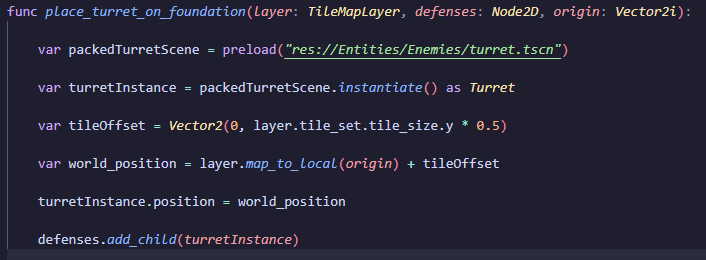
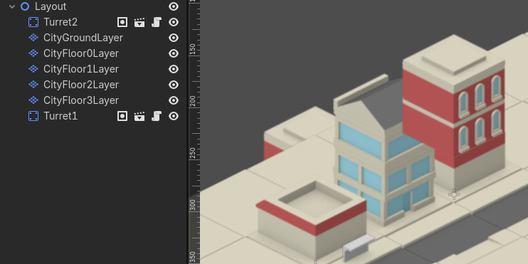
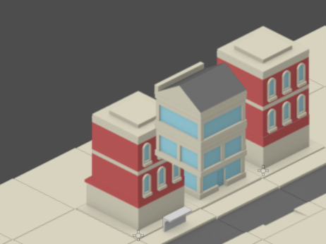
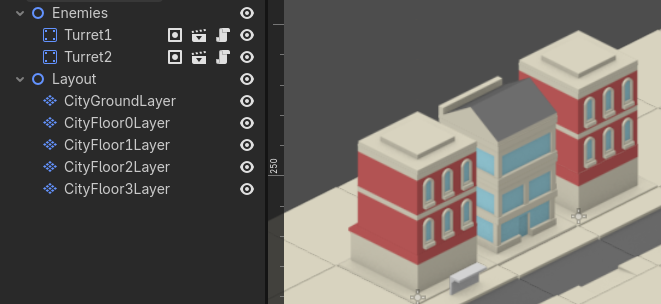
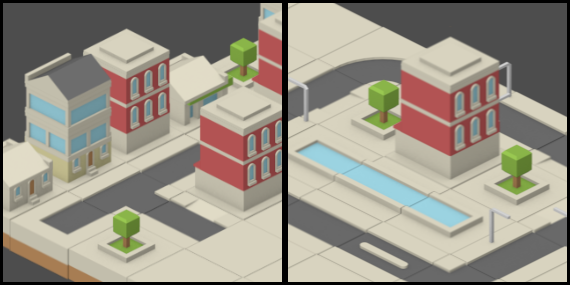

# Combining TileMapLayers with Node2D

Greetings, fellow traveler. Looking into adding some moving parts in your 2D tile maps ? Maybe you've already tried and got stuck with weird placement or clipping ?

Then this might help! In this week's blog post I write about adding custom `Node2D` scenes on top of an existing `TileMapLayer`, the issues that spun from it and how I was able to fix them, ending up with an almost seamless combination of `TileMapLayers` and `Node2D` instances!

Let's start with a quick question : In this image, can you tell which building is a custom `Node2D` with `Sprite2D` and which belongs to my `TileMapLayers` ?

> Hum, the middle one with all the windows ? 'Cause the bottom part is different.

Fair guess. But it's actually the red building on the right.

In that image, all "bottom"/ground sections are regular tiles. The Node2D-based builting is sitting on top of it. Neat trick, right ?

> It is! So, careful placement gives it this effect ?

Well, it needs careful placement but that's only part of it. To get the effect with the pieces I wanted to use, it actually took a good dosage of research and a bit of trial and error.

Here's a few examples, side by side, of the issues I got when I tried to do this :

It ranged from the Node instance being always on top (or bottom) of everything, not (Y) sorting properly when placed behind other tile-based things and, when that worked, it would *always* stay behind other tile-based things, even when it was clearly in front of it.

> That doesn't sound like fun.

No it was not. In fact, it was so troublesome for me - who's learning the Godot engine as I go - that I am making sure I write this somewhere, because if this issue happens again, I will loose my nerve. But enough of that.

On the next section I will write about the different ideas I tried and the issues associated with them. If you want, you can scroll down to see which idea I ended up with, but I do recommend reading through the whole thing. Even if some ideas did not work for *my* use case, that doesn't mean they are *bad* ideas. They could very well help you fixing your specific problem.

### Creating the Node2D Turret Scene

For the `Node2D` scene, I decided to create a "Turret" since it is one of the core elements I will need in my game, with a small caveat. Since I don't have any turret-specific assets, I am using the red-themed building sprites and making sure I only use those when I want to represent "enemies" in general. 

Since I will be reusing my current assets, I decided to create a `StaticBody2D` scene with 3 `Sprite2D` child nodes instead of the typical one. In each sprite I add the corresponding "section" of the turret by grabbing the corresponding "tile" from the assets, similar to how I create the buildings in the `TileMapLayers`. (And don't forget the mandatory `CollisionShape2D`)

For the textures themselves, I discovered the "atlas texture" option which fits quite well with what I already had! I am able to use one sprite image with all the tiles and then configure which "piece" to use for the final texture. Using our `TileSet` setup from earlier in the project, we know already the measures for the width and height of each tile, it's just a matter of choosing the correct X and Y coordinates for the "tile" we want! 

Also, quick tip : for the X and Y values, we can use the base width and height values (respectively) and multiply by the "coordinates" in the atlas image. If we write in the input the formula (example : 130 * 5) Godot will do the math and write the final value for us!

With this, I have access to all the tiles I currently use in the `TileMapLayers`. In the future, I will try to change the displayed "tiles" in runtime, but for now I will stick with this very "turret-like" turret.

Then, to place the Sprites in their correct heights, I change `Position` > `Y` of each Sprite. We can check the values we used on the `TileMapLayers` to create the multiple heights and use those here. Also, notice how the final result seems to be "floating" in the air, when compared to the origin of the Scene. This is intended, so it "sits" properly when I instance it on top of the "foundation" tiles I place during the map generation.

Finally, for the code snippet to spawn one turret into the scene, I ended up with something similar to this (notice the "tileOffset" that I used to make the turret position match a tile's bottom left corner):

### [Tried] Simply adding the Turret on the main Scene

Instancing a Turret side-by-side of the `TileMapLayers` makes it so the sprites render either on top or at the bottom of existing Tiles. Moving it up or down in the node tree only "shifts" the issue one way or the other, so it's a no go. Without mentioning the fact that it would be cumbersome to manage later on, having all the nodes in the same "level" like this.

After researching online, multiple sources point out "y sorting" as root cause for this. I already have it enabled on all my `TileMapLayers`, and enabling it messes up with my `Sprite2D` ordering and placement, so there must be another place to configure it.

### [Tried] Setting per-tile Y sort

Exploring around the Godot editor, I found out that we can configure the `Y Sort Origin` property on a per-tile basis by going to `TileSet` > `Select` > picking a tile > looking under `Rendering`. Using the same height values we've used multiples times by now, I can see some "improvements", but still far from what I want. 

Better, but not good enough. Not only I still have an unorganized list of nodes from the first idea, I now have restricted myself by having to pair one tile to one "valid height".

However, this was a good experiment. If I end up in a different scenario where I have multiple tiles being drawn at the same height, this could be used to ensure the order of rendering between them. For example, make sure that small decorations always render on top of walls and roads, but below tall lamp posts. 

### [Worked] Wrapper Node2Ds + Y sort 

Turns out, all problems can be fixed with simple solutions and a bit of structure.

By having two `Node2D` nodes acting as wrappers as childs of my root node, one for the `TileMapLayers` and one for the `Node2Ds` (which, for my purposes, are "Enemies"), we can achieve the organization goal I mentioned earlier. If I need to grab all enemies at once, I just have to query all childs of "Enemies".

Now, all we really need to do is toggling `Y Sort Enabled` under `Ordering` in each wrapper node and it's done

> Really ? That's it ?

Yup! Sometimes the simplest answer is, more often than not, the correct answer. I got so focused in one part of the problem - the nodes themselves I was interacting with - that I was not considering the "parent" elements and how they can influence the rendering order. Also, a night's rest does wonders.

Using this, I was finally able to place the Turret nodes in between my tile-based buildings with none of the issues!

Quick mention : Since I now have *more* elements being created on the city, I naturally had to update the saving/loading-related methods to accomodate the new Turret info. I decided to create a new "CityData" class that contains two properties (for now) : the existing CityLayout and an array of "EnemyData" elements that contains the info I need about the Turrets I placed, with some tricks here and there to help me *not* touch this so soon in case I expand with more enemy types. If you're curious about this too, let me know.

And with that last bit, it's the end of this update!

Hope this blog post was helpful in any way.  
Got a question or just wanna discuss something? Feel free to reach out!  
And thank you for reading!