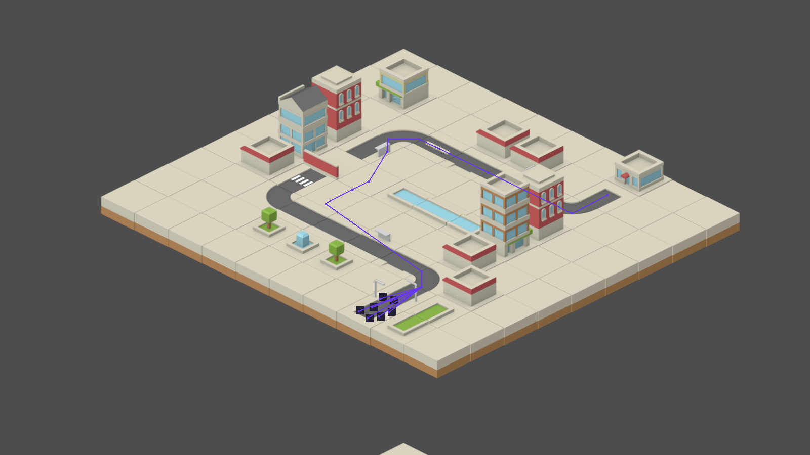

# Allowing units to Navigate within TileMaps

Greetings, fellow traveler. Have you managed to design a level layout with roads and other elements ? Wouldn't it be nice if those tiles were more than just "visuals" and actually walkable ? 


If that's the case, then I might be able to help! In this week's blog post, I write about further improving my City Map by adding actual "navigation" capabilities by leveraging Godot's `NavigationRegion2D` and other related Nodes.

So far, I have been making progress on the visual portion of my City map generation, but my goal is to be able to have multiple "units" move (or "navigate") from one point to another with no effort.

> Is it that big of a deal ? Changing the position property every so often should work, no ?

Well yes, but actually no. 

To make something "move" we have to change it's position, that part is correct. But it is far from the "only" thing. Here's a quick demonstration. If I only worry about an element's position, I would end with something like this:


As you just saw, the little square moved in a straight line to it's goal. Not that impressive. However, with proper navigation support, it can look like this instead:


> Ooh, I see! The unit is following the road path, like in a tower defense!

Yeah, sorta like a tower defense. There are actually multiple ways of implementing "navigation" in a game, depending on your project needs. In a super short explanation : You can either implement "Path following" - *fixed path between two points that a unit follows* - or "Path finding" - *pick any point in a "area" and a unit finds a path to it*.

For my project needs, I decided to implement "Path finding". Which means a few things:
- I have to define a "region" in my city map for my units to walk on.
- I want this region to be defined based off my existing `TileSet` and `TileMapLayer` work
- I need to tell my units to use this region and calculate the best path to reach their goal.

I researched online about the kinds of tools and algorithms that could be used for this task, ranking higher those that are Godot-native and that are more configuration-based than code-based, so it's easier to maintain.

With all this in mind, I ended up with 3 options: 
- Use `AStar2D` (and it's variant `AStarGrid2D`) by recreating a map layout with it and performing all navigation-related tasks with it
- Use `TileSets` built-in `NavigationLayers` to define the walkable "region" paired with a `NavigationAgent2D` to handle the unit's movement
- Use `NavigationRegion2D` node to define the walkable "region", also pairs with the `NavigationAgent2D` to handle the unit's movement.

All options have their pros and cons, so be sure to check which makes sense for *your* project. As for me, since I am heavily using `TileSet` to create my city maps, my focus goes directly to the built-in `NavigationLayers`. It's a great starting point that allow to add navigation to an existing map and only require some configurations to get started. However, they lack some features that the more powerful `NavigationRegion2D` have (some of which I actually want).

Luckily, there is a perfect solution for my needs. There is a way to set up `NavigationRegion2D` to get it's configuration from an existing `TileMapLayer`, requiring us to set it up with the exact same steps we would already need to in order to use the built-in `TileSet` version.

> Does that mean what I think it means ? 

Yup! It means we can start by implementing the more approachable version, test it and, once we are ready for *more*, move on to the more powerfull version *while* reusing all of our previous work!

So, here's the plan : For starters, I will set up a `NavigationLayer` and showcase it a little bit. Then I'll move on to the `NavigationRegion2D` and see how far I can take it. Feel free to skip ahead to that version if you already have the basics down, or stop after setting up the first one if it's enough for what you need.

## Creating a simple "Navigator" node

Regardless of the version we implement, we will need something to actually "navigate". For that, we can create a simple "navigator" that simply walks to the target position upon start. 

Create a basic `Node2D` scene with any collision shape and sprite you want. Add a `NavigationAgent2D` node as a child. Heads up, it will show *a lot* of properties to fine tune the navigation. Only thing that matters for now is making sure that little "number" in the `NavigationLayer` property matches between the `NavigationAgent2D` and `NavigationLayer` (for example, have "1" in both). Finish off by attaching a script to the root node, so we can add some basic movement logic. Here's a template script:

```
extends Node2D

var navigation_agent: NavigationAgent2D
var movement_speed: float

# Call this on your main scene to set any goal within your map
# if you're getting your position from a TileMap's cell, use map_to_local 
func set_target(pos: Vector2i):
    navigation_agent.target_position = target_position

func _ready():
    movement_speed = 1000.0 #Change this to speed/slow things down
    navigation_agent = $NavigationAgent2D #Double check this to match your own setup

    navigation_agent.velocity_computed.connect(_on_velocity_computed) #Useful if you turn on "avoidance"

func _physics_process(delta):
	if navigation_agent.is_navigation_finished():
		return

	var current_agent_position: Vector2 = global_position
	var next_path_position: Vector2 = navigation_agent.get_next_path_position()
	
	var new_velocity: Vector2 = current_agent_position.direction_to(next_path_position) * movement_speed
	if navigation_agent.avoidance_enabled:
		navigation_agent.set_velocity(new_velocity)
	else:
		_on_velocity_computed(new_velocity)

func _on_velocity_computed(safe_velocity: Vector2):
	entity.velocity = safe_velocity
	entity.move_and_slide()
```

This should be enough to test out the upcoming navigation set up.

## Setting up a NavigationLayer in a TileSet

If you're reading this section, I will assume you have already used a `TileSet` somewhere in your project. If not, don't worry. You can set up one quickly with free assets (like me!) follow along. I should have a blog post or two about it in this series, if you're wondering.

To create a `NavigationLayer` it's as simple as selecting your `TileSet` in the `Inspector` tab (easiest way : click on any `TileMapLayer` that it's using it currently, look at the `Inspector` tab, then click on the `TileSet` property to expand it), look for a section named "Navigation Layers" and click on `Add Element`. You should have an item with a bunch of numbers in it.

> What are the numbers for ? 

Those numbers are different "layers" a given navigation layer can belong to. Imagine a game with different kinds of zones, like grass, sand, river, sky, the classics, and you want to create all kinds of enemies that can chase the player in some (or all) of these zones. If you "map" (conceptually) each of these zones to one of those number, you can very quickly set up `NavigationLayers` that belong to different zones, enemies that can only walk on solid ground (matching two or three groups at once) or enemies that can only fly (matching only one group). Just an example, but hope it gives you an idea.

> More or less, yeah. Need to experiment a bit first

That's the spirit!

Now that we have one `NavigationLayer`, we can go into the `TileSet` tab > `Select` section, pick a few tiles and set them up to *belong* to this `NavigationLayer`. There's a "Navigation" section for that, allowing us to "draw" the area of the tile that is actually walkable (for those cases where we have a tile that is partially covered by a decoration or something). Or you can click on the 3-dots button and press "Reset to default tile shape". Which was what I did. We can always come back and fine tune the shapes later.

And that's pretty much it. To make it easier for us to see what's happening, we can do a few things:
- in the `Inspector` tab, find a "Navigation" section (not inside the `TileSet`) and change the "Visibility Mode" to "Force show"`. It will paint the tiles with any navigation layer set up in your editor.
- in the `Debug` menu, you can turn on "Visible Navigation" to also paint the same tiles while you are debugging the project

If all goes well, you should end up with something like this:


Our little square can very easily follow the road path that we layed out with our existing `TileSet`. I also changed the `NavigationAgent2D` > `Path Postprocessing` to "Edgecentered" so it would move in the middle of the road. Neat, right ? 

> Looks great! But I wonder, what "more" is there to set up, really ? 

Well, keep reading. Might surprise you.

## Baking a NavigationRegion2D from a TileMapLayer

Up until this point, we got our simple squares moving along the road we created using nothing but our Tiles. However, I want to add *more* to my game.

> Again, I ask. What "more" could there really be ?

This setup works just fine because, at the end of the day, we achieved a simple goal : Have *one* type of walkable tile. What if we had multiple ? What if these different types of "walkable tiles" had different properties to them ? What if you want the "pathfinding" logic to prefer walking on "road" over "dirt" ? Or dynamically spawn obstacles on your map that would force your enemies to take a different route ?

> Well, I ... Don't know how to do any of that.

Neither did I, when I reached this point. But those are some common examples that the `NavigationRegion2D` allow us to do, after setting it up.

The typical setup is pretty straighforward. You add a `NavigationRegion2D` as a child to your scene, then go over to the `Inspector` tab and create a new `NavigationPolygon`. We then will be able to use the Editor's tools to draw a "region" (typically a rectangle) where we want our units to navigate on. We may then other elements to create obstacles (for example a node with a `NavigationObstacle2D` child). When we are done setting it up, we press "Bake Navigation" and we should have a bunch of geometric figures within that region we drew, representing the walkable surface. 

This works fine *if* we are using static maps. But I am generating mine, so I need to also "bake" the region after that. Also, don't know "exactly" the dimensions of my map (Well, technically I do. But pretend I don't) nor do I want "all" tiles within its boundaries to be walkable. Only road tiles and plain ground tiles. *And* I want for my units to walk on the ground tiles *only* if there are no road tiles. This puts me in a particular spot.

So, to address all of this concerns and goals I got, here's the master plan:
- I will create **two** `NavigationLayers` on my `TileSet`. One for my Road tiles, another for my Ground tiles, and do the respective mappings.
- I will create **two** `NavigationRegion2D` nodes on my city, instead of one.
- I will set things up so I end up with 1x "NavRegion" for the road section and 1x "NavRegion" for the "everything else" section, and tune them so that the first one looks "better" for pathing reasons.
- I will also "connect" both regions, so they act as one.
- I then add a new step at the end of my city map generation to "bake" both regions.

Sounds simple ? 

> No, not really. How are we setting this all up ?

With magic. Or effort. One of the two. Jokes aside, it did take some effort to figure out how to set up all this pieces together to reach the goal I set up. But hey, now it's done. And it's written here. Keep reading!

First step, the creation of the two `NavigationLayers`, is pretty straighforward. Feel free to go back and read that section again. We could even do these with only one layer, and set all tiles (road and ground) to it, but I like having both of these at the `TileSet` level, purely for organization reasons.

Next, we create two instances of the `NavigationRegion2D` node on our scene and, in each, create the `NavigationPolygon` resource. But this time, we **don't** setup the region with the editor. Now, if we look at the `Inspector` tab, under `Geometry`, we have two very specific properties I want to highlight: the "Source Geometry Mode" and "Source Geometry Group". These two combined allow us to set up from which nodes our NavRegions pull data from when "baking". By default, they pull from everything in the scene. However, if we change the "Mode" to "Group With Children" and write that group's name on the other property, we can filter out to only pull data from the nodes *we* want.

Here's the good news and the *tricky* news:
- The good news: This means we can set it up so one region only looks at one `TileMapLayer` (by setting it to "group A", for example) and have another region only look at another `TileMapLayer` with a different group.
- The tricky news: This means that, in order for this to work, I have to revisit my map generation logic so that all road tiles are placed in a "RoadLayer" and all the other tiles are place in a "GroundLayer". Which took me a while to do (mostly because I did other refactors during it, so don't get scared)

So, as long as we have multiple `TileMapLayers` with the different types of tiles sorted between them, we can get this working. I didn't (had all the "base" tiles in the "GroundLayer"). If you already have this sorted on your end, that's great! If not, you might need to give it a look over in order to implement this idea fully.

By setting up the two `NavigationRegion2Ds` as I described (changing the mode and group name in each), we can then press the "Bake NavigationPolygon" button on each and see the end result. It should look something like this:


> Mine is similar, but I don't have the purple lines

Nice eye. Those purple lines indicate that two different regions are "connected" and any `NavigatorAgent2D` can switch between the two. By default, Godot only "connects" the regions if they are actually touching each other. Ours, however, have a small "margin". Which is normal, it's to allow our units to actually touch the borders of our region if needed be. (Seems a bit weird, I know. But it makes sense. If you're curious, you can look up what the "Agent radius" does)

To change this behaviour, we can go into the `Project` menu > `Project Settings` > `Navigation` > `2D` and increase the "Default Edge Connection Margin". My suggestion is to change it to 20 (2 times the "agent radius" value).

> That did the trick, nice!

Great! Now, one last detail. Remember the "road vs. ground" preference thing I mentioned ? That can be controlled by fine tuning the "costs" associated with a given `NavigationRegion2D`. The "Enter Cost" and "Travel Cost", to be precise. You can find both on the `Inspector` tab. These two will influence the "decisions" our little square will make when choosing the best path. So, for my use case, I increased the costs only on my "Ground NavRegion".

And that's all the setup with need! Now, whenever we want to "bake" our custom regions in our code, all we have to do is invoke the `bake_navigation_polygon()` in each and we are set! Here's a few examples of it working:


*(In this next one, I "broke" the road to make the units use the regular ground tiles)*



## Closing Notes

It took me a while to find and compiling all the necessary bits of information, but I think the final result was worth it. The units can navigate within the map, preferring the layed-out roads whenever possible while still retaining the ability to use regular ground tiles. It's also directly connected to my `TileSet` configurations, so I don't have to risk having a second set of configurations that doesn't line up with the first one.

I was also able to make some progress in other areas of the project during this. Mostly internal refactors in preparation for the next steps. For example, did you notice the Turrets basic shooting ? Don't worry if not, once that section is "good enough" I will write about that too!

Hope this blog post was helpful in any way.  
Got a question or just wanna discuss something? Feel free to reach out!  
And thank you for reading!
