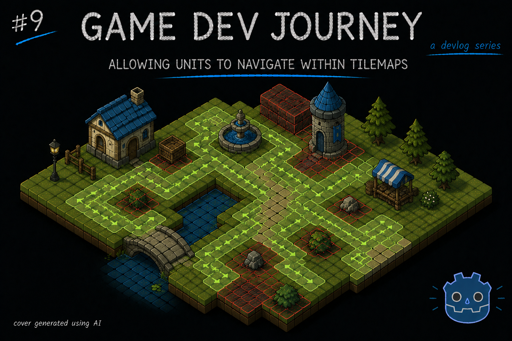
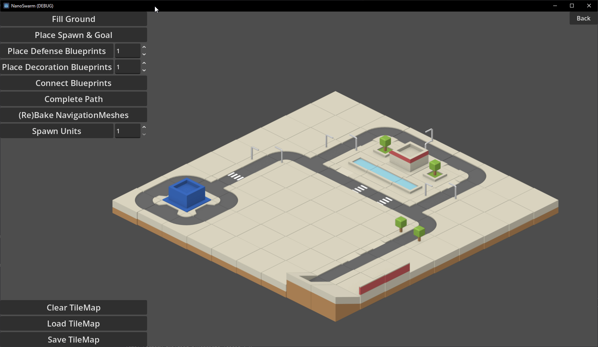
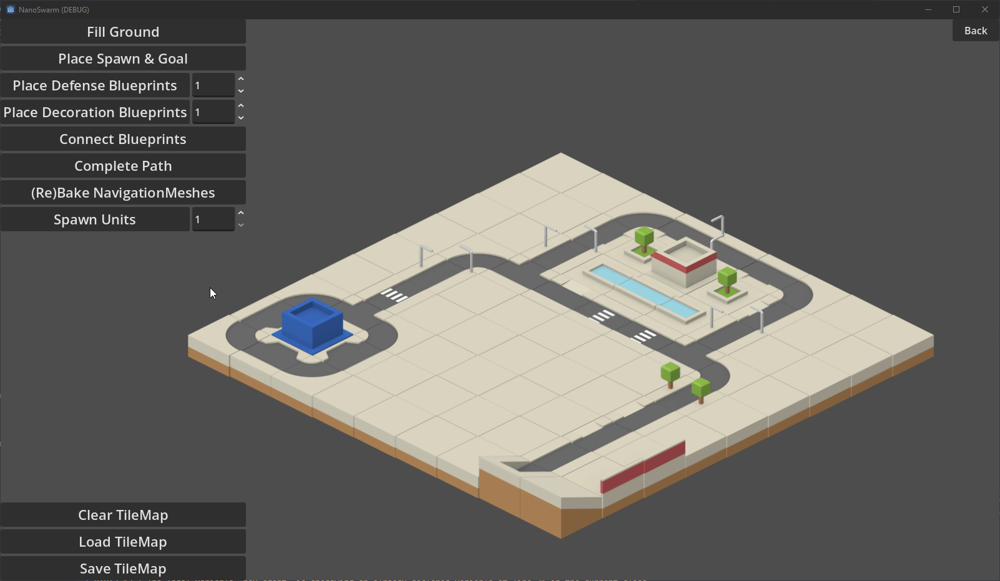
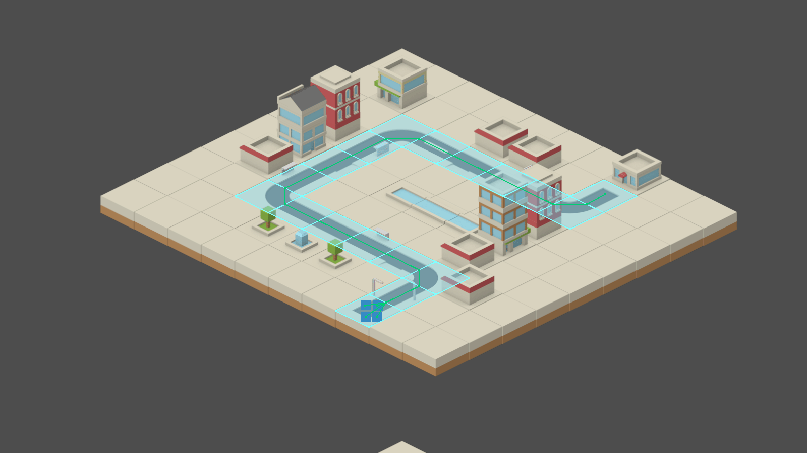
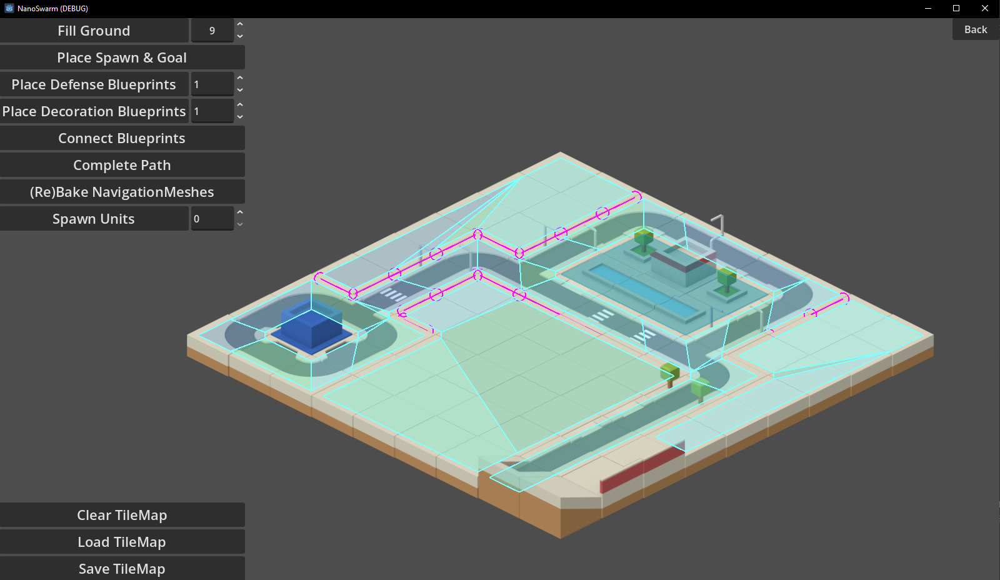
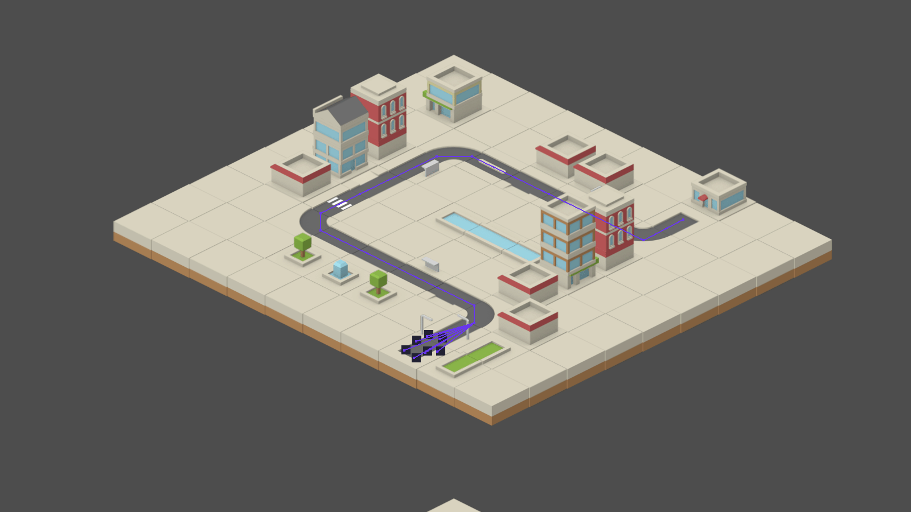

# Allowing units to Navigate within TileMaps

Greetings, fellow traveler. Have you managed to design a level layout with roads and other elements ? Wouldn't it be nice if those tiles were more than just "visuals" and actually walkable ? 



If that's the case, then I might be able to help! In this week's blog post, I write about further improving my City Map by adding actual "navigation" capabilities by leveraging Godot's `NavigationRegion2D` and other related Nodes.

So far, I have been making progress on the visual portion of my City map generation, but my goal is to be able to have multiple "units" move (or "navigate") from one point to another with no effort.

> Is it that big of a deal ? Changing the position property every so often should work, no ?

Well yes, but actually no. 

To make something "move" we have to change it's position, that part is correct. But it is far from the "only" thing. Here's a quick demonstration. If I only worry about an element's position, I would end with something like this:



As you just saw, the little square moved in a straight line to it's goal. Not that impressive. However, with proper navigation support, it can look like this instead:



> Ooh, I see! The unit is following the road path, like in a tower defense!

Yeah, sorta like a tower defense. There are actually multiple ways of implementing "navigation" in a game, depending on your project needs. In a super short explanation : You can either implement "Path following" - *fixed path between two points that a unit follows* - or "Path finding" - *pick any point in a "area" and a unit finds a path to it*.

For my project needs, I decided to implement "Path finding". Which means a few things:
- I have to define a "region" in my city map for my units to walk on.
- I want this region to be defined based off my existing `TileSet` and `TileMapLayer` work
- I need to tell my units to use this region and calculate the best path to reach their goal.

I researched online about the kinds of tools and algorithms that could be used for this task, ranking higher those that are Godot-native and that are more configuration-based than code-based, so it's easier to maintain.

With all this in mind, I ended up with 3 options: 
- Use `AStar2D` (and it's variant `AStarGrid2D`) by recreating a map layout with it and performing all navigation-related tasks with it
- Use `TileSets` built-in `NavigationLayers` to define the walkable "region" paired with a `NavigationAgent2D` to handle the unit's movement
- Use `NavigationRegion2D` node to define the walkable "region", also pairs with the `NavigationAgent2D` to handle the unit's movement.

All options have their pros and cons, so be sure to check which makes sense for *your* project. As for me, since I am heavily using `TileSet` to create my city maps, my focus goes directly to the built-in `NavigationLayers`. It's a great starting point that allow to add navigation to an existing map and only require some configurations to get started. However, they lack some features that the more powerful `NavigationRegion2D` have (some of which I actually want).

Luckily, there is a perfect solution for my needs. There is a way to set up `NavigationRegion2D` to get it's configuration from an existing `TileMapLayer`, requiring us to set it up with the exact same steps we would already need to in order to use the built-in `TileSet` version.

> Does that mean what I think it means ? 

Yup! It means we can start by implementing the more approachable version, test it and, once we are ready for *more*, move on to the more powerfull version *while* reusing all of our previous work!

So, here's the plan : For starters, I will set up a `NavigationLayer` and showcase it a little bit. Then I'll move on to the `NavigationRegion2D` and see how far I can take it. Feel free to skip ahead to that version if you already the basics, or stop after setting up the first one if it's enough for what you need.

## Creating a simple "Navigator" node

Regardless of the version we implement, we will need something to actually "navigate". For that, we can create a simple "navigator" that simply walks to the target position upon start. 

Create a basic `Node2D` scene with any collision shape and sprite you want. Add a `NavigationAgent2D` node as a child. Heads up, it will show *a lot* of properties to fine tune the navigation. Only thing that matters for now is making sure that little "number" in the `NavigationLayer` property matches between the `NavigationAgent2D` and `NavigationLayer` (for example, have "1" in both).

```
- talk about move code
- talk about setting navAgent's target_position
```

## Setting up a NavigationLayer in a TileSet

If you're reading this section, I will assume you have already used a `TileSet` somewhere in your project. If not, don't worry. You can set up one quickly with free assets (like me!) follow along. I should have a blog post or two about it in this series, if you're wondering.

To create a `NavigationLayer` it's as simple as selecting your `TileSet` in the `Inspector` tab (easiest way : click on any `TileMapLayer` that it's using it currently, look at the `Inspector` tab, then click on the `TileSet` property to expand it), look for a section named "Navigation Layers" and click on `Add Element`. You should have an item with a bunch of numbers in it.

> What are the numbers for ? 

Those numbers are different "layers" a given navigation layer can belong to. Imagine a game with different kinds of zones, like grass, sand, river, sky, the classics, and you want to create all kinds of enemies that can chase the player in some (or all) of these zones. If you "map" (conceptually) each of these zones to one of those number, you can very quickly set up `NavigationLayers` that belong to different zones, enemies that can only walk on solid ground (matching two or three groups at once) or enemies that can only fly (matching only one group). Just an example, but hope it gives you an idea.

> More or less, yeah. Need to experiment a bit first

That's the spirit!

Now that we have one `NavigationLayer`, we can go into the `TileSet` tab > `Select` section, pick a few tiles and set them up to *belong* to this `NavigationLayer`. There's a "Navigation" section for that, allowing us to "draw" the area of the tile that is actually walkable (for those cases where we have a tile that is partially covered by a decoration or something). Or you can click on the 3-dots button and press "Reset to default tile shape". Which was what I did. We can always come back and fine tune the shapes later.

And that's pretty much it. To make it easier for us to see what's happening, we can do a few things:
- in the `Inspector` tab, find a "Navigation" section (not inside the `TileSet`) and change the "Visibility Mode" to "Force show"`. It will paint the tiles with any navigation layer set up in your editor.
- in the `Debug` menu, you can turn on "Visible Navigation" to also paint the same tiles while you are debugging the project

If all goes well, you should end up with something like this:



Our little square can very easily follow the road path that we layed out with our existing `TileSet`. Neat, right ? 

## Baking a NavigationRegion2D from a TileMapLayer





## Closing Notes

It took me a while to find and compiling all the necessary bits of information, but I think the final result was worth it. The units can navigate within the map, preferring the layed-out roads whenever possible while still retaining the ability to use regular ground tiles. It's also directly connected to my `TileSet` configurations, so I don't have to risk having a second set of configurations that doesn't line up with the first one.

I was also able to make some progress in other areas of the project during this. Mostly internal refactors in preparation for the next steps. For example, did you notice the Turrets basic shooting ? Don't worry if not, once that section is "good enough" I will write about that too!

Hope this blog post was helpful in any way.  
Got a question or just wanna discuss something? Feel free to reach out!  
And thank you for reading!
